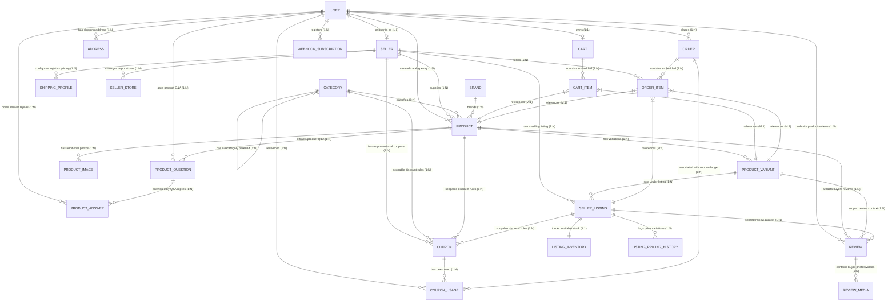

# HMarketplace — Entity Relationship (ER) Diagram, Database Schema & Complete API Routes Reference

Below is the comprehensive architectural specification for the HMarketplace backend database and all REST API endpoints. This document serves as a complete reference, containing the unified entity relationship structures, Mongoose schemas, and explicit database/usage guides for every single API route.

---

## 📊 Database Relationship Diagram



---

## 🗃️ Database Entities & Field Specifications (Code-Aligned)

### 1. USER
Represents consumers, sellers, or administrators. Password hashing is automated using AES-256-CBC and buffered signup writes are handled via a write-back redis queue.
```json
{
  "_id": "ObjectId",
  "fullName": "string [required, 2-50 chars]",
  "email": "string [required, unique, lowercase]",
  "phone": "string [required, unique]",
  "passwordHash": "string [required]",
  "avatarUrl": "string [default: '']",
  "role": "customer | seller | admin [default: customer]",
  "isActive": "boolean [default: true]",
  "lastLoginAt": "Date [optional]",
  "createdAt": "Date",
  "updatedAt": "Date"
}
```

### 2. SELLER
Represents a vendor business profile linked to a user.
```json
{
  "_id": "ObjectId",
  "userId": "ObjectId [ref: User, unique, required]",
  "businessName": "string [required]",
  "gstNumber": "string [required, unique, valid GSTIN format]",
  "businessPhone": "string [required]",
  "businessEmail": "string [required, lowercase]",
  "approvalStatus": "pending | approved | rejected [default: pending]",
  "isKycCompleted": "boolean [default: false]",
  "rejectionReason": "string [default: '']",
  "approvedBy": "ObjectId [ref: User, optional]",
  "approvedAt": "Date [optional]",
  "ratingAverage": "number [default: 0, 0-5 bounds]",
  "totalSales": "number [default: 0]",
  "createdAt": "Date",
  "updatedAt": "Date"
}
```

### 3. ADDRESS
Fulfillment delivery addresses belonging to users.
```json
{
  "_id": "ObjectId",
  "userId": "ObjectId [ref: User, required]",
  "fullName": "string [required]",
  "phone": "string [required]",
  "line1": "string [required]",
  "line2": "string [required]",
  "landmark": "string [default: '']",
  "city": "string [required]",
  "state": "string [required]",
  "country": "string [required]",
  "pincode": "string [required]",
  "isDefault": "boolean [default: false]",
  "createdAt": "Date",
  "updatedAt": "Date"
}
```

### 4. CATEGORY
Hierarchical product classification categories.
```json
{
  "_id": "ObjectId",
  "name": "string [required]",
  "slug": "string [unique, lowercase]",
  "parentId": "ObjectId [ref: Category, default: null]",
  "level": "number [default: 1]",
  "path": "string[] [default: []]",
  "isLeaf": "boolean [default: true]",
  "sortOrder": "number [default: 1]",
  "imageUrl": "string [default: '']",
  "isActive": "boolean [default: true]",
  "createdAt": "Date",
  "updatedAt": "Date"
}
```

### 5. BRAND
Verified platform or seller-defined product brands.
```json
{
  "_id": "ObjectId",
  "name": "string [required]",
  "slug": "string [unique, lowercase]",
  "logoUrl": "string [default: '']",
  "isVerified": "boolean [default: false]",
  "isActive": "boolean [default: true]",
  "createdBy": "ObjectId [ref: User, default: null]",
  "createdAt": "Date",
  "updatedAt": "Date"
}
```

### 6. PRODUCT (Master Catalog)
Contains standard, rich, and SEO-optimized catalog descriptors.
```json
{
  "_id": "ObjectId",
  "categoryId": "ObjectId [ref: Category, required]",
  "brandId": "ObjectId [ref: Brand, required]",
  "sellerId": "ObjectId [ref: Seller, default: null]",
  "title": "string [required]",
  "slug": "string [unique, lowercase]",
  "description": {
    "short": "string [default: '']",
    "long": "Mixed [default: '']"
  },
  "highlights": "string[] [default: []]",
  "searchKeywords": "string[] [default: []]",
  "attributeValues": "Mixed [default: {}]",
  "specifications": "Mixed [default: {}]",
  "richDescription": "Mixed [default: '']",
  "seo": {
    "metaTitle": "string [default: '']",
    "metaDescription": "string [default: '']",
    "canonicalUrl": "string [default: '']"
  },
  "defaultVariantId": "ObjectId [ref: ProductVariant, default: null]",
  "status": "draft | active | blocked [default: active]",
  "moderationStatus": "pending | approved | hidden | removed [default: pending]",
  "moderationReason": "string [default: '']",
  "moderatedBy": "ObjectId [ref: User, optional]",
  "approvedBy": "ObjectId [ref: User, optional]",
  "ratingAverage": "number [default: 0, 0-5 bounds]",
  "reviewCount": "number [default: 0]",
  "createdBy": "ObjectId [ref: User, optional]",
  "createdAt": "Date",
  "updatedAt": "Date"
}
```

### 7. PRODUCT_IMAGE
Catalog media assets mapping.
```json
{
  "_id": "ObjectId",
  "catalogProductId": "ObjectId [ref: Product, required]",
  "variantId": "ObjectId [ref: ProductVariant, default: null]",
  "type": "image | video [default: image]",
  "imageUrl": "string [required]",
  "alt": "string [default: '']",
  "angle": "front | back | side | top | isometric | detail | lifestyle | other [default: null]",
  "sortOrder": "number [default: 0]",
  "isPrimary": "boolean [default: false]",
  "createdAt": "Date"
}
```

### 8. PRODUCT_VARIANT
A unique SKU combination under a master product entry.
```json
{
  "_id": "ObjectId",
  "catalogProductId": "ObjectId [ref: Product, required]",
  "sku": "string [required, unique, uppercase]",
  "variantAttributes": "Record<string, string> [required]",
  "barcode": "string [default: '']",
  "weight": "number [default: 0]",
  "dimensions": {
    "length": "number [default: 0]",
    "width": "number [default: 0]",
    "height": "number [default: 0]"
  },
  "isActive": "boolean [default: true]",
  "createdAt": "Date",
  "updatedAt": "Date"
}
```

### 9. SELLER_LISTING
Specific commercial offer issued by an approved seller for a variant.
```json
{
  "_id": "ObjectId",
  "sellerId": "ObjectId [ref: Seller, required]",
  "variantId": "ObjectId [ref: ProductVariant, required]",
  "sellerSku": "string [required]",
  "condition": "new | refurbished [default: new]",
  "procurementType": "stock | dropship [default: stock]",
  "fulfillmentType": "seller | platform [default: seller]",
  "shippingProfileId": "ObjectId [ref: ShippingProfile, default: null]",
  "status": "active | paused | blocked [default: active]",
  "createdAt": "Date",
  "updatedAt": "Date"
}
```

### 10. LISTING_INVENTORY
Real-time physical stock counts of a seller listing offer.
```json
{
  "_id": "ObjectId",
  "listingId": "ObjectId [ref: SellerListing, required]",
  "availableQuantity": "number [default: 0]",
  "reservedQuantity": "number [default: 0]",
  "damagedQuantity": "number [default: 0]",
  "lowStockThreshold": "number [default: 5]"
}
```

### 11. LISTING_PRICING_HISTORY
Tracks financial historical price variations in Paise (no floating points).
```json
{
  "_id": "ObjectId",
  "listingId": "ObjectId [ref: SellerListing, required]",
  "mrpPaise": "number [required]",
  "sellingPricePaise": "number [required]",
  "endAt": "Date [default: null]",
  "startAt": "Date [required]",
  "createdAt": "Date"
}
```

### 12. CART
Persistent pre-purchase item storage, using pricing snapshots for checkout locking.
```json
{
  "_id": "ObjectId",
  "userId": "ObjectId [ref: User, unique, required]",
  "couponCode": "string [default: null]",
  "items": [
    {
      "productId": "ObjectId [ref: Product, required]",
      "variantId": "ObjectId [ref: ProductVariant, default: null]",
      "quantity": "number [required, min: 1]",
      "titleSnapshot": "string [required]",
      "imageSnapshot": "string [default: '']",
      "pricePaiseSnapshot": "number [required]"
    }
  ],
  "createdAt": "Date",
  "updatedAt": "Date"
}
```

### 13. COUPON
Campaign coupons targeting specific categories, products, or seller listing offers.
```json
{
  "_id": "ObjectId",
  "sellerId": "ObjectId [ref: Seller, required]",
  "code": "string [required, unique, uppercase]",
  "discountType": "percent | flat [required]",
  "discountValue": "number [required]",
  "minOrderValue": "number [default: 0]",
  "maxDiscountValue": "number [optional]",
  "usageLimit": "number [required]",
  "perUserLimit": "number [default: 1]",
  "usedCount": "number [default: 0]",
  "startsAt": "Date [required]",
  "endsAt": "Date [required]",
  "isActive": "boolean [default: true]",
  "applicableProducts": "ObjectId[] [ref: Product, default: []]",
  "applicableCategories": "ObjectId[] [ref: Category, default: []]",
  "applicableListings": "ObjectId[] [ref: SellerListing, default: []]",
  "createdAt": "Date",
  "updatedAt": "Date"
}
```

### 14. COUPON_USAGE
Maintains transaction histories of discount code applications.
```json
{
  "couponId": "ObjectId [ref: Coupon, required]",
  "userId": "ObjectId [ref: User, required]",
  "orderId": "ObjectId [ref: Order, required]",
  "discountPaise": "number [required]",
  "usedAt": "Date [required]"
}
```

### 15. ORDER
Checkout snapshots for Cash-on-Delivery (COD) orders (no float pricing).
```json
{
  "_id": "ObjectId",
  "userId": "ObjectId [ref: User, required]",
  "addressId": "ObjectId [ref: Address, required]",
  "addressSnapshot": {
    "fullName": "string [required]",
    "phone": "string [required]",
    "line1": "string [required]",
    "line2": "string [required]",
    "landmark": "string [default: '']",
    "city": "string [required]",
    "state": "string [required]",
    "country": "string [required]",
    "pincode": "string [required]"
  },
  "couponCode": "string [default: null]",
  "couponDiscountPaise": "number [default: 0]",
  "mrpTotalPaise": "number [required]",
  "sellingTotalPaise": "number [required]",
  "productDiscountPaise": "number [default: 0]",
  "totalPaise": "number [required]",
  "paymentStatus": "pending | paid | failed | refunded | partially_refunded [default: pending]",
  "paymentMethod": "cod [required]",
  "status": "pending | confirmed | processing | shipped | delivered | cancelled | return_requested | returned [default: pending]",
  "notes": "string [default: null]",
  "cancellationReason": "string [default: null]",
  "items": [
    {
      "productId": "ObjectId [ref: Product, required]",
      "variantId": "ObjectId [ref: ProductVariant, default: null]",
      "listingId": "ObjectId [ref: SellerListing, default: null]",
      "sellerId": "ObjectId [ref: Seller, required]",
      "titleSnapshot": "string [required]",
      "imageSnapshot": "string [default: '']",
      "sku": "string [default: '']",
      "quantity": "number [required, min: 1]",
      "mrpPaiseSnapshot": "number [required]",
      "sellingPricePaiseSnapshot": "number [required]",
      "couponDiscountPaiseForItem": "number [default: 0]"
    }
  ],
  "createdAt": "Date",
  "updatedAt": "Date"
}
```

### 16. WEBHOOK_SUBSCRIPTION
Outbound event notification subscriptions registered by approved sellers or admins.
```json
{
  "_id": "ObjectId",
  "userId": "ObjectId [ref: User, required]",
  "url": "string [required]",
  "secret": "string [required]",
  "events": "string[] [required] — ['order.created', 'order.cancelled', 'order.status_updated']",
  "isActive": "boolean [default: true]",
  "createdAt": "Date",
  "updatedAt": "Date"
}
```

### 17. REVIEW
Product catalog reviews. Recalculates product rating statistics asynchronously.
```json
{
  "_id": "ObjectId",
  "catalogProductId": "ObjectId [ref: Product, required]",
  "variantId": "ObjectId [ref: ProductVariant, default: null]",
  "listingId": "ObjectId [ref: SellerListing, default: null]",
  "userId": "ObjectId [ref: User, required]",
  "rating": "number [required, 1-5 bounds]",
  "title": "string [required]",
  "comment": "string [required]",
  "verifiedPurchase": "boolean [default: false]",
  "helpfulVotes": "number [default: 0]",
  "status": "pending | approved | hidden [default: approved]",
  "createdAt": "Date",
  "updatedAt": "Date"
}
```

### 18. REVIEW_MEDIA
Media uploads linked to reviews.
```json
{
  "_id": "ObjectId",
  "reviewId": "ObjectId [ref: Review, required]",
  "type": "image | video [default: image]",
  "url": "string [required]",
  "createdAt": "Date"
}
```

### 19. PRODUCT_QUESTION
Product Q&A question board.
```json
{
  "_id": "ObjectId",
  "catalogProductId": "ObjectId [ref: Product, required]",
  "userId": "ObjectId [ref: User, required]",
  "question": "string [required]",
  "status": "pending | approved | hidden [default: approved]",
  "createdAt": "Date",
  "updatedAt": "Date"
}
```

### 20. PRODUCT_ANSWER
Product Q&A replies. Flags answers written by the merchant with `isSellerAnswer = true`.
```json
{
  "_id": "ObjectId",
  "questionId": "ObjectId [ref: ProductQuestion, required]",
  "userId": "ObjectId [ref: User, required]",
  "answer": "string [required]",
  "isSellerAnswer": "boolean [default: false]",
  "helpfulVotes": "number [default: 0]",
  "createdAt": "Date",
  "updatedAt": "Date"
}
```

### 21. SHIPPING_PROFILE
Custom seller shipping and freight processing profiles.
```json
{
  "_id": "ObjectId",
  "sellerId": "ObjectId [ref: Seller, required]",
  "name": "string [required]",
  "processingDays": "number [required]",
  "shippingType": "free | paid [default: free]",
  "baseChargePaise": "number [default: 0]",
  "codAvailable": "boolean [default: true]",
  "freeShippingAbove": "number [default: null]",
  "createdAt": "Date",
  "updatedAt": "Date"
}
```

### 22. SELLER_STORE
Fulfillment centers and warehouses, saving spatial Point coordinates for circular GeoJSON searches.
```json
{
  "_id": "ObjectId",
  "sellerId": "ObjectId [ref: Seller, required]",
  "name": "string [required]",
  "address": {
    "line1": "string [required]",
    "city": "string [required]",
    "state": "string [required]",
    "country": "string [required]",
    "pincode": "string [required]"
  },
  "location": {
    "type": "string [default: 'Point']",
    "coordinates": "number[] [required] — [longitude, latitude] GeoJSON format"
  },
  "isActive": "boolean [default: true]",
  "createdAt": "Date",
  "updatedAt": "Date"
}
```

---

## 🛣️ Unified HTTP API Routes & Usage Manual

This reference contains the usage configuration details for **every single REST API route** in the HMarketplace backend, with proper authentication requirements, headers, query filters, JSON payloads, response types, and complete, realistic code/curl request-response examples.

All protected endpoints rely on a **cookie-session** established via Passport.js after calling the `/auth/login` endpoint. Ensure you pass the `Cookie: session=...` header on subsequent requests.

### Base URL: `http://localhost:3000/api`

---

### 1. Authentication & Profile Management (`/auth`)

#### `POST /auth/register`
* **Access Control**: Public / Guest
* **Content-Type**: `multipart/form-data`
* **Request Body**:
  * `fullName` (string, required): Minimum 2 chars
  * `email` (string, required): Valid unique email address
  * `password` (string, required): Minimum 6 chars
  * `phone` (string, required): Valid unique phone number
  * `avatar` (file, optional): Binary avatar photo upload
* **Response**: `201 Created`
* **Example**:
  ```bash
  curl -X POST http://localhost:3000/api/auth/register \
    -F "fullName=Jane Doe" \
    -F "email=jane@example.com" \
    -F "password=securepass123" \
    -F "phone=+919876543210" \
    -F "avatar=@avatar.jpg"
  ```
  ```json
  {
    "success": true,
    "message": "Registration successful. Welcome aboard!",
    "user": {
      "_id": "6474b5c7f1a3b4e1a0c8b9d0",
      "fullName": "Jane Doe",
      "email": "jane@example.com",
      "phone": "+919876543210",
      "role": "customer",
      "isActive": true,
      "avatarUrl": "http://localhost:3000/uploads/avatar_1685362119.jpg",
      "createdAt": "2026-05-29T11:00:00.000Z",
      "updatedAt": "2026-05-29T11:00:00.000Z"
    }
  }
  ```

#### `POST /auth/login`
* **Access Control**: Public / Guest
* **Content-Type**: `application/json`
* **Request Body**:
  ```json
  {
    "email": "jane@example.com",
    "password": "securepass123"
  }
  ```
* **Response**: `200 OK` (Sets `Set-Cookie` headers)
* **Example**:
  ```bash
  curl -X POST http://localhost:3000/api/auth/login \
    -H "Content-Type: application/json" \
    -d '{"email":"jane@example.com","password":"securepass123"}' -c cookies.txt
  ```
  ```json
  {
    "success": true,
    "message": "Login successful.",
    "user": {
      "_id": "6474b5c7f1a3b4e1a0c8b9d0",
      "fullName": "Jane Doe",
      "email": "jane@example.com",
      "role": "customer"
    }
  }
  ```

#### `POST /auth/logout`
* **Access Control**: Authenticated (Any role)
* **Response**: `200 OK`
* **Example**:
  ```bash
  curl -X POST http://localhost:3000/api/auth/logout -b cookies.txt
  ```
  ```json
  {
    "success": true,
    "message": "Logged out successfully."
  }
  ```

#### `GET /auth/me`
* **Access Control**: Authenticated (Any role)
* **Response**: `200 OK`
* **Example**:
  ```bash
  curl -X GET http://localhost:3000/api/auth/me -b cookies.txt
  ```
  ```json
  {
    "success": true,
    "user": {
      "_id": "6474b5c7f1a3b4e1a0c8b9d0",
      "fullName": "Jane Doe",
      "email": "jane@example.com",
      "phone": "+919876543210",
      "role": "customer",
      "isActive": true,
      "avatarUrl": "http://localhost:3000/uploads/avatar_1685362119.jpg"
    }
  }
  ```

#### `PUT /auth/me`
* **Access Control**: Authenticated (Any role)
* **Content-Type**: `multipart/form-data`
* **Request Body**:
  * `fullName` (string, optional)
  * `avatar` (file, optional)
* **Response**: `200 OK`
* **Example**:
  ```bash
  curl -X PUT http://localhost:3000/api/auth/me \
    -H "Cookie: session=..." \
    -F "fullName=Jane Updated"
  ```
  ```json
  {
    "success": true,
    "message": "Profile updated successfully.",
    "user": {
      "_id": "6474b5c7f1a3b4e1a0c8b9d0",
      "fullName": "Jane Updated",
      "email": "jane@example.com",
      "phone": "+919876543210",
      "role": "customer",
      "avatarUrl": "http://localhost:3000/uploads/avatar_1685362119.jpg"
    }
  }
  ```

#### `DELETE /auth/me`
* **Access Control**: Authenticated (Any role)
* **Response**: `200 OK` (Closes profile, cascades to delete SELLER profile if role was seller)
* **Example**:
  ```bash
  curl -X DELETE http://localhost:3000/api/auth/me -b cookies.txt
  ```
  ```json
  {
    "success": true,
    "message": "Account deleted successfully."
  }
  ```

#### `GET /auth/users`
* **Access Control**: Admin Only
* **Query Parameters**:
  * `page` (number, default: 1)
  * `limit` (number, default: 20)
* **Response**: `200 OK`
* **Example**:
  ```bash
  curl -X GET "http://localhost:3000/api/auth/users?page=1&limit=2" -b cookies.txt
  ```
  ```json
  {
    "success": true,
    "users": [
      {
        "_id": "6474b5c7f1a3b4e1a0c8b9d0",
        "fullName": "Jane Doe",
        "email": "jane@example.com",
        "role": "customer",
        "isActive": true
      },
      {
        "_id": "6474c5d8f1a4b5e2b1c9c0e1",
        "fullName": "Seller Ravi",
        "email": "ravi@shop.com",
        "role": "seller",
        "isActive": true
      }
    ],
    "pagination": {
      "page": 1,
      "limit": 2,
      "total": 42,
      "pages": 21
    }
  }
  ```

#### `GET /auth/users/:id`
* **Access Control**: Authenticated (Self or Admin only)
* **Response**: `200 OK`
* **Example**:
  ```bash
  curl -X GET http://localhost:3000/api/auth/users/6474b5c7f1a3b4e1a0c8b9d0 -b cookies.txt
  ```
  ```json
  {
    "success": true,
    "user": {
      "_id": "6474b5c7f1a3b4e1a0c8b9d0",
      "fullName": "Jane Doe",
      "email": "jane@example.com",
      "phone": "+919876543210",
      "role": "customer",
      "isActive": true
    }
  }
  ```

#### `PUT /auth/users/:id/status`
* **Access Control**: Admin Only
* **Request Body**:
  ```json
  {
    "isActive": false
  }
  ```
* **Response**: `200 OK`
* **Example**:
  ```bash
  curl -X PUT http://localhost:3000/api/auth/users/6474b5c7f1a3b4e1a0c8b9d0/status \
    -H "Content-Type: application/json" \
    -d '{"isActive":false}' -b cookies.txt
  ```
  ```json
  {
    "success": true,
    "message": "User active status updated.",
    "user": {
      "_id": "6474b5c7f1a3b4e1a0c8b9d0",
      "fullName": "Jane Doe",
      "isActive": false
    }
  }
  ```

#### `DELETE /auth/users/:id`
* **Access Control**: Admin Only
* **Response**: `200 OK`
* **Example**:
  ```bash
  curl -X DELETE http://localhost:3000/api/auth/users/6474b5c7f1a3b4e1a0c8b9d0 -b cookies.txt
  ```
  ```json
  {
    "success": true,
    "message": "User hard deleted successfully."
  }
  ```

---

### 2. Sellers & Listings Subsystem (`/seller`)

#### `POST /seller/register`
* **Access Control**: Public / Guest
* **Content-Type**: `multipart/form-data`
* **Request Body**:
  * `fullName` (string, required)
  * `email` (string, required)
  * `password` (string, required)
  * `phone` (string, required)
  * `businessName` (string, required)
  * `gstNumber` (string, required): GSTIN India Format
  * `businessPhone` (string, required)
  * `businessEmail` (string, required)
  * `avatar` (file, optional)
* **Response**: `201 Created`
* **Example**:
  ```bash
  curl -X POST http://localhost:3000/api/seller/register \
    -F "fullName=Ravi Kumar" \
    -F "email=ravi@ravishop.com" \
    -F "password=strongsellerpass" \
    -F "phone=+919900112233" \
    -F "businessName=Ravi Electronics" \
    -F "gstNumber=29GGGGG1234A1Z5" \
    -F "businessPhone=+919900112233" \
    -F "businessEmail=contact@ravishop.com"
  ```
  ```json
  {
    "success": true,
    "message": "Seller onboarding registration successful. Awaiting admin approval.",
    "user": {
      "_id": "6474d5e9f1a5b6e3c2d0d1f2",
      "fullName": "Ravi Kumar",
      "role": "seller"
    },
    "seller": {
      "_id": "6474d5e9f1a5b6e3c2d0d1f3",
      "businessName": "Ravi Electronics",
      "gstNumber": "29GGGGG1234A1Z5",
      "approvalStatus": "pending"
    }
  }
  ```

#### `GET /seller/analytics/dashboard`
* **Access Control**: Approved Seller Only
* **Response**: `200 OK` (Aggregated statistics from db, cached in Redis)
* **Example**:
  ```bash
  curl -X GET http://localhost:3000/api/seller/analytics/dashboard -b cookies.txt
  ```
  ```json
  {
    "success": true,
    "analytics": {
      "totalRevenuePaise": 5990000,
      "totalSales": 12,
      "lowStockAlerts": [
        {
          "listingId": "6474f70bf1a7b8e5c4d2d3f5",
          "availableQuantity": 2,
          "sku": "ELEC-HEAD-XM4"
        }
      ],
      "recentReviews": [
        {
          "rating": 5,
          "comment": "Superb sound quality! Approved.",
          "title": "Amazing!"
        }
      ]
    }
  }
  ```

#### `POST /seller/listings`
* **Access Control**: Approved Seller Only
* **Request Body**:
  ```json
  {
    "variantId": "6474e6fcf1a6b7e4c3d1d2f4",
    "sellerSku": "R-XM4-BLACK",
    "condition": "new",
    "procurementType": "stock",
    "fulfillmentType": "seller",
    "shippingProfileId": "6474a4b6f1a2b3e0a9c7b8d9",
    "pricePaise": 1999900,
    "comparePricePaise": 2499900,
    "inventory": 50
  }
  ```
* **Response**: `201 Created`
* **Example**:
  ```bash
  curl -X POST http://localhost:3000/api/seller/listings \
    -H "Content-Type: application/json" \
    -d '{"variantId":"6474e6fcf1a6b7e4c3d1d2f4","sellerSku":"R-XM4-BLACK","pricePaise":1999900,"inventory":50}' -b cookies.txt
  ```
  ```json
  {
    "success": true,
    "message": "Listing and inventory provisioned successfully.",
    "listing": {
      "_id": "6474f70bf1a7b8e5c4d2d3f5",
      "sellerId": "6474d5e9f1a5b6e3c2d0d1f3",
      "variantId": "6474e6fcf1a6b7e4c3d1d2f4",
      "sellerSku": "R-XM4-BLACK",
      "condition": "new"
    },
    "inventory": {
      "availableQuantity": 50,
      "reservedQuantity": 0
    }
  }
  ```

#### `GET /seller/listings`
* **Access Control**: Approved Seller Only
* **Response**: `200 OK` (Includes current inventory levels and active pricing snapshots)
* **Example**:
  ```bash
  curl -X GET http://localhost:3000/api/seller/listings -b cookies.txt
  ```
  ```json
  {
    "success": true,
    "listings": [
      {
        "_id": "6474f70bf1a7b8e5c4d2d3f5",
        "sellerSku": "R-XM4-BLACK",
        "condition": "new",
        "variantDetails": {
          "sku": "SONY-WH1000XM4"
        },
        "inventory": {
          "availableQuantity": 50,
          "reservedQuantity": 0
        },
        "pricing": {
          "sellingPricePaise": 1999900,
          "mrpPaise": 2499900
        }
      }
    ]
  }
  ```

#### `PUT /seller/listings/:id`
* **Access Control**: Approved Seller Only (Own Listing)
* **Request Body**:
  ```json
  {
    "pricePaise": 1899900,
    "comparePricePaise": 2499900,
    "inventory": 60,
    "status": "active"
  }
  ```
* **Response**: `200 OK` (Closes active historical price ledger and creates a new one if price is modified)
* **Example**:
  ```bash
  curl -X PUT http://localhost:3000/api/seller/listings/6474f70bf1a7b8e5c4d2d3f5 \
    -H "Content-Type: application/json" \
    -d '{"pricePaise":1899900,"inventory":60}' -b cookies.txt
  ```
  ```json
  {
    "success": true,
    "message": "Listing details and pricing logs updated successfully.",
    "listing": {
      "_id": "6474f70bf1a7b8e5c4d2d3f5",
      "status": "active"
    }
  }
  ```

#### `DELETE /seller/listings/:id`
* **Access Control**: Approved Seller Only (Own Listing)
* **Response**: `200 OK` (Cascades deletion across inventories and pricing logs)
* **Example**:
  ```bash
  curl -X DELETE http://localhost:3000/api/seller/listings/6474f70bf1a7b8e5c4d2d3f5 -b cookies.txt
  ```
  ```json
  {
    "success": true,
    "message": "Listing and related inventory entries deleted."
  }
  ```

#### `POST /seller/brands`
* **Access Control**: Approved Seller Only
* **Content-Type**: `multipart/form-data`
* **Request Body**:
  * `name` (string, required): Brand name
  * `logo` (file, optional): Brand logo file
* **Response**: `201 Created`
* **Example**:
  ```bash
  curl -X POST http://localhost:3000/api/seller/brands \
    -F "name=Acoustic Labs" \
    -F "logo=@logo.png" -b cookies.txt
  ```
  ```json
  {
    "success": true,
    "message": "Brand onboarding requested. Pending admin verification.",
    "brand": {
      "_id": "647400aaf1a8b9e6c5d3d4f6",
      "name": "Acoustic Labs",
      "isVerified": false
    }
  }
  ```

#### `GET /seller/brands`
* **Access Control**: Approved Seller Only
* **Response**: `200 OK` (List of custom brands registered by this seller)
* **Example**:
  ```bash
  curl -X GET http://localhost:3000/api/seller/brands -b cookies.txt
  ```
  ```json
  {
    "success": true,
    "brands": [
      {
        "_id": "647400aaf1a8b9e6c5d3d4f6",
        "name": "Acoustic Labs",
        "isVerified": false,
        "createdAt": "2026-05-29T11:00:00.000Z"
      }
    ]
  }
  ```

#### `PUT /seller/brands/:id/status`
* **Access Control**: Admin Only
* **Request Body**:
  ```json
  {
    "isVerified": true
  }
  ```
* **Response**: `200 OK`
* **Example**:
  ```bash
  curl -X PUT http://localhost:3000/api/seller/brands/647400aaf1a8b9e6c5d3d4f6/status \
    -H "Content-Type: application/json" \
    -d '{"isVerified":true}' -b cookies.txt
  ```
  ```json
  {
    "success": true,
    "message": "Brand verification status updated.",
    "brand": {
      "_id": "647400aaf1a8b9e6c5d3d4f6",
      "name": "Acoustic Labs",
      "isVerified": true
    }
  }
  ```

#### `DELETE /seller/brands/:id`
* **Access Control**: Approved Seller (Own brand) or Admin (Any brand)
* **Response**: `200 OK` (Blocked if active products use it)
* **Example**:
  ```bash
  curl -X DELETE http://localhost:3000/api/seller/brands/647400aaf1a8b9e6c5d3d4f6 -b cookies.txt
  ```
  ```json
  {
    "success": true,
    "message": "Brand deleted successfully."
  }
  ```

#### `GET /seller/profile`
* **Access Control**: Authenticated Seller (Any status)
* **Response**: `200 OK`
* **Example**:
  ```bash
  curl -X GET http://localhost:3000/api/seller/profile -b cookies.txt
  ```
  ```json
  {
    "success": true,
    "profile": {
      "_id": "6474d5e9f1a5b6e3c2d0d1f3",
      "businessName": "Ravi Electronics",
      "businessEmail": "contact@ravishop.com",
      "gstNumber": "29GGGGG1234A1Z5",
      "approvalStatus": "approved",
      "ratingAverage": 4.5
    }
  }
  ```

#### `PUT /seller/profile`
* **Access Control**: Authenticated Seller (Any status)
* **Request Body**:
  ```json
  {
    "businessName": "Ravi Electronics Pro",
    "businessPhone": "+919900112244"
  }
  ```
* **Response**: `200 OK`
* **Example**:
  ```bash
  curl -X PUT http://localhost:3000/api/seller/profile \
    -H "Content-Type: application/json" \
    -d '{"businessName":"Ravi Electronics Pro"}' -b cookies.txt
  ```
  ```json
  {
    "success": true,
    "message": "Seller business profile updated.",
    "profile": {
      "_id": "6474d5e9f1a5b6e3c2d0d1f3",
      "businessName": "Ravi Electronics Pro"
    }
  }
  ```

#### `DELETE /seller/profile`
* **Access Control**: Authenticated Seller (Any status)
* **Response**: `200 OK` (Purges `Seller` record, reverts `USER.role` to `"customer"`)
* **Example**:
  ```bash
  curl -X DELETE http://localhost:3000/api/seller/profile -b cookies.txt
  ```
  ```json
  {
    "success": true,
    "message": "Seller profile deactivated. Your user account role is reverted to customer."
  }
  ```

#### `GET /seller`
* **Access Control**: Admin Only
* **Query Parameters**:
  * `status` (string, options: `pending`, `approved`, `rejected`)
* **Response**: `200 OK`
* **Example**:
  ```bash
  curl -X GET "http://localhost:3000/api/seller?status=pending" -b cookies.txt
  ```
  ```json
  {
    "success": true,
    "sellers": [
      {
        "_id": "6474d5e9f1a5b6e3c2d0d1f3",
        "businessName": "Ravi Electronics",
        "approvalStatus": "pending"
      }
    ]
  }
  ```

#### `GET /seller/:id`
* **Access Control**: Public / Guest
* **Response**: `200 OK` (Public business profile contact info)
* **Example**:
  ```bash
  curl -X GET http://localhost:3000/api/seller/6474d5e9f1a5b6e3c2d0d1f3
  ```
  ```json
  {
    "success": true,
    "seller": {
      "_id": "6474d5e9f1a5b6e3c2d0d1f3",
      "businessName": "Ravi Electronics Pro",
      "ratingAverage": 4.5,
      "totalSales": 120
    }
  }
  ```

#### `PUT /seller/:id/status`
* **Access Control**: Admin Only
* **Request Body**:
  ```json
  {
    "approvalStatus": "approved",
    "rejectionReason": ""
  }
  ```
* **Response**: `200 OK` (Triggers `isKycCompleted: true` on approval, dispatches welcome or rejection email)
* **Example**:
  ```bash
  curl -X PUT http://localhost:3000/api/seller/6474d5e9f1a5b6e3c2d0d1f3/status \
    -H "Content-Type: application/json" \
    -d '{"approvalStatus":"approved"}' -b cookies.txt
  ```
  ```json
  {
    "success": true,
    "message": "Seller status updated. Notification email dispatched.",
    "seller": {
      "_id": "6474d5e9f1a5b6e3c2d0d1f3",
      "approvalStatus": "approved",
      "isKycCompleted": true
    }
  }
  ```

#### `DELETE /seller/:id`
* **Access Control**: Admin Only
* **Response**: `200 OK` (Hard-deletes SELLER profile and referenced USER account)
* **Example**:
  ```bash
  curl -X DELETE http://localhost:3000/api/seller/6474d5e9f1a5b6e3c2d0d1f3 -b cookies.txt
  ```
  ```json
  {
    "success": true,
    "message": "Seller business profile and user account purged."
  }
  ```

---

### 3. Addresses Management (`/address`)

*All routes under `/address` require active user authentication.*

#### `POST /api/address`
* **Request Body**:
  ```json
  {
    "fullName": "Jane Doe",
    "phone": "+919876543210",
    "line1": "42 MG Road, Indiranagar",
    "line2": "Apartment 3C, Prestige Heights",
    "landmark": "Opposite Metro Pillar 12",
    "city": "Bengaluru",
    "state": "Karnataka",
    "country": "India",
    "pincode": "560008",
    "isDefault": true
  }
  ```
* **Response**: `201 Created` (If `isDefault` is true, clears default status on user's other addresses)
* **Example**:
  ```bash
  curl -X POST http://localhost:3000/api/address \
    -H "Content-Type: application/json" \
    -d '{"fullName":"Jane Doe","phone":"+919876543210","line1":"42 MG Road","line2":"Apt 3C","city":"Bengaluru","state":"Karnataka","country":"India","pincode":"560008","isDefault":true}' -b cookies.txt
  ```
  ```json
  {
    "success": true,
    "message": "Address added successfully.",
    "address": {
      "_id": "647411aaf1a9b0e7c6d4d5f7",
      "fullName": "Jane Doe",
      "city": "Bengaluru",
      "isDefault": true
    }
  }
  ```

#### `GET /api/address`
* **Response**: `200 OK` (Sorted with default address first)
* **Example**:
  ```bash
  curl -X GET http://localhost:3000/api/address -b cookies.txt
  ```
  ```json
  {
    "success": true,
    "addresses": [
      {
        "_id": "647411aaf1a9b0e7c6d4d5f7",
        "fullName": "Jane Doe",
        "line1": "42 MG Road",
        "city": "Bengaluru",
        "isDefault": true
      }
    ]
  }
  ```

#### `GET /api/address/:id`
* **Access Control**: Owner or Admin
* **Response**: `200 OK`
* **Example**:
  ```bash
  curl -X GET http://localhost:3000/api/address/647411aaf1a9b0e7c6d4d5f7 -b cookies.txt
  ```
  ```json
  {
    "success": true,
    "address": {
      "_id": "647411aaf1a9b0e7c6d4d5f7",
      "fullName": "Jane Doe",
      "line1": "42 MG Road",
      "city": "Bengaluru"
    }
  }
  ```

#### `PUT /api/address/:id`
* **Access Control**: Owner Only
* **Request Body**:
  ```json
  {
    "line1": "45 Residency Road",
    "isDefault": true
  }
  ```
* **Response**: `200 OK`
* **Example**:
  ```bash
  curl -X PUT http://localhost:3000/api/address/647411aaf1a9b0e7c6d4d5f7 \
    -H "Content-Type: application/json" \
    -d '{"line1":"45 Residency Road"}' -b cookies.txt
  ```
  ```json
  {
    "success": true,
    "message": "Address updated successfully.",
    "address": {
      "_id": "647411aaf1a9b0e7c6d4d5f7",
      "line1": "45 Residency Road"
    }
  }
  ```

#### `DELETE /api/address/:id`
* **Access Control**: Owner Only
* **Response**: `200 OK` (Automatically promotes another address to default if the deleted address was default)
* **Example**:
  ```bash
  curl -X DELETE http://localhost:3000/api/address/647411aaf1a9b0e7c6d4d5f7 -b cookies.txt
  ```
  ```json
  {
    "success": true,
    "message": "Address deleted."
  }
  ```

---

### 4. Catalog Products & Categories (`/product`)

#### `POST /product/categories`
* **Access Control**: Admin Only
* **Request Body**:
  ```json
  {
    "name": "Audio Equipment",
    "parentId": "647422bbf1aab1e8c7d5d6f8",
    "sortOrder": 1,
    "imageUrl": "http://localhost:3000/uploads/cat_audio.png"
  }
  ```
* **Response**: `201 Created` (Invalidates category caches)
* **Example**:
  ```bash
  curl -X POST http://localhost:3000/api/product/categories \
    -H "Content-Type: application/json" \
    -d '{"name":"Audio Equipment","sortOrder":1}' -b cookies.txt
  ```
  ```json
  {
    "success": true,
    "message": "Category created successfully.",
    "category": {
      "_id": "647433ccf1abb2e9c8d6d7f9",
      "name": "Audio Equipment",
      "slug": "audio-equipment",
      "level": 1
    }
  }
  ```

#### `GET /product/categories`
* **Access Control**: Public
* **Response**: `200 OK` (Hits Redis cache; falls back to DB query + saves to cache)
* **Example**:
  ```bash
  curl -X GET http://localhost:3000/api/product/categories
  ```
  ```json
  {
    "success": true,
    "categories": [
      {
        "_id": "647433ccf1abb2e9c8d6d7f9",
        "name": "Audio Equipment",
        "slug": "audio-equipment"
      }
    ]
  }
  ```

#### `GET /product/categories/:id`
* **Access Control**: Public
* **Response**: `200 OK`
* **Example**:
  ```bash
  curl -X GET http://localhost:3000/api/product/categories/647433ccf1abb2e9c8d6d7f9
  ```
  ```json
  {
    "success": true,
    "category": {
      "_id": "647433ccf1abb2e9c8d6d7f9",
      "name": "Audio Equipment"
    }
  }
  ```

#### `PUT /product/categories/:id`
* **Access Control**: Admin Only
* **Request Body**:
  ```json
  {
    "name": "Premium Audio",
    "isActive": true
  }
  ```
* **Response**: `200 OK`
* **Example**:
  ```bash
  curl -X PUT http://localhost:3000/api/product/categories/647433ccf1abb2e9c8d6d7f9 \
    -H "Content-Type: application/json" \
    -d '{"name":"Premium Audio"}' -b cookies.txt
  ```
  ```json
  {
    "success": true,
    "message": "Category updated.",
    "category": {
      "_id": "647433ccf1abb2e9c8d6d7f9",
      "name": "Premium Audio"
    }
  }
  ```

#### `DELETE /product/categories/:id`
* **Access Control**: Admin Only
* **Response**: `200 OK` (Soft deletes category, updates child levels)
* **Example**:
  ```bash
  curl -X DELETE http://localhost:3000/api/product/categories/647433ccf1abb2e9c8d6d7f9 -b cookies.txt
  ```
  ```json
  {
    "success": true,
    "message": "Category deactivated."
  }
  ```

#### `GET /product/brands`
* **Access Control**: Public
* **Response**: `200 OK` (Returns public verified brands and approved custom seller brands)
* **Example**:
  ```bash
  curl -X GET http://localhost:3000/api/product/brands
  ```
  ```json
  {
    "success": true,
    "brands": [
      {
        "_id": "647400aaf1a8b9e6c5d3d4f6",
        "name": "Sony Corporation",
        "isVerified": true
      }
    ]
  }
  ```

#### `GET /product/slug/:slug`
* **Access Control**: Public
* **Response**: `200 OK` (Returns detailed product catalog, including active variants, listings, and stock)
* **Example**:
  ```bash
  curl -X GET http://localhost:3000/api/product/slug/sony-wh-1000xm4-ac7e8
  ```
  ```json
  {
    "success": true,
    "product": {
      "_id": "6474e5faf1a6b7e4c3d1d2f3",
      "title": "Sony WH-1000XM4",
      "slug": "sony-wh-1000xm4-ac7e8",
      "description": {
        "short": "Industry leading noise cancelling headphones",
        "long": "Detailed specifications about the premium SONY XM4 ANC headphones..."
      },
      "ratingAverage": 4.8,
      "reviewCount": 12,
      "variants": [
        {
          "_id": "6474e6fcf1a6b7e4c3d1d2f4",
          "sku": "SONY-WH1000XM4-BLACK",
          "variantAttributes": {
            "Color": "Black"
          }
        }
      ]
    }
  }
  ```

#### `POST /product/:id/images`
* **Access Control**: Approved Seller (Must own catalog product)
* **Content-Type**: `multipart/form-data`
* **Request Body**:
  * `thumbnail` (file, optional): Single image file representing the product thumbnail (sets `isPrimary: true`, overrides old primary)
  * `images` (file array, max 10 files, optional): Supplementary details images (sets `isPrimary: false`)
  * `angles` (text, optional): JSON array representing camera angles matching the details images (e.g. `["side", "back"]`)
* **Response**: `201 Created`
* **Example**:
  ```bash
  curl -X POST http://localhost:3000/api/product/6474e5faf1a6b7e4c3d1d2f3/images \
    -F "thumbnail=@thumb.jpg" \
    -F "images=@head1.jpg" \
    -F "images=@head2.jpg" \
    -F "angles=[\"side\",\"back\"]" -b cookies.txt
  ```
  ```json
  {
    "success": true,
    "message": "3 images uploaded and linked successfully.",
    "images": [
      {
        "_id": "647444ddf1acc3eac9d7d8fa",
        "catalogProductId": "6474e5faf1a6b7e4c3d1d2f3",
        "imageUrl": "http://localhost:3000/uploads/thumb_16853625.jpg",
        "isPrimary": true,
        "angle": "front"
      },
      {
        "_id": "647444ddf1acc3eac9d7d8fb",
        "catalogProductId": "6474e5faf1a6b7e4c3d1d2f3",
        "imageUrl": "http://localhost:3000/uploads/head1_16853626.jpg",
        "isPrimary": false,
        "angle": "side"
      }
    ]
  }
  ```

#### `DELETE /product/images/:imageId`
* **Access Control**: Approved Seller (Must own catalog product)
* **Response**: `200 OK`
* **Example**:
  ```bash
  curl -X DELETE http://localhost:3000/api/product/images/647444ddf1acc3eac9d7d8fa -b cookies.txt
  ```
  ```json
  {
    "success": true,
    "message": "Image record and asset deleted."
  }
  ```

#### `GET /product/variants/:id`
* **Access Control**: Authenticated (Any role)
* **Response**: `200 OK`
* **Example**:
  ```bash
  curl -X GET http://localhost:3000/api/product/variants/6474e6fcf1a6b7e4c3d1d2f4 -b cookies.txt
  ```
  ```json
  {
    "success": true,
    "variant": {
      "_id": "6474e6fcf1a6b7e4c3d1d2f4",
      "catalogProductId": "6474e5faf1a6b7e4c3d1d2f3",
      "sku": "SONY-WH1000XM4-BLACK",
      "variantAttributes": {
        "Color": "Black"
      }
    }
  }
  ```

#### `PUT /product/variants/:variantId`
* **Access Control**: Approved Seller (Owner of variant catalog)
* **Request Body**:
  ```json
  {
    "sku": "SONY-WH1000XM4-BLK",
    "weight": 254
  }
  ```
* **Response**: `200 OK`
* **Example**:
  ```bash
  curl -X PUT http://localhost:3000/api/product/variants/6474e6fcf1a6b7e4c3d1d2f4 \
    -H "Content-Type: application/json" \
    -d '{"sku":"SONY-WH1000XM4-BLK"}' -b cookies.txt
  ```
  ```json
  {
    "success": true,
    "message": "Variant properties updated.",
    "variant": {
      "_id": "6474e6fcf1a6b7e4c3d1d2f4",
      "sku": "SONY-WH1000XM4-BLK"
    }
  }
  ```

#### `DELETE /product/variants/:variantId`
* **Access Control**: Approved Seller (Owner of variant catalog)
* **Response**: `200 OK` (Cascades deletion across listing components)
* **Example**:
  ```bash
  curl -X DELETE http://localhost:3000/api/product/variants/6474e6fcf1a6b7e4c3d1d2f4 -b cookies.txt
  ```
  ```json
  {
    "success": true,
    "message": "Variant and its associated sales listing cleared."
  }
  ```

#### `POST /product`
* **Access Control**: Approved Seller Only
* **Request Body**:
  ```json
  {
    "title": "Sony WH-1000XM4",
    "categoryId": "647433ccf1abb2e9c8d6d7f9",
    "brandId": "647400aaf1a8b9e6c5d3d4f6",
    "description": {
      "short": "Noise Cancelling",
      "long": "Excellent acoustics"
    },
    "highlights": ["ANC", "30-hr battery"],
    "specifications": {
      "Frequency Response": "4Hz-40kHz",
      "Driver": "40mm dome"
    },
    "richDescription": "HTML or rich text overview...",
    "seo": {
      "metaTitle": "Buy SONY WH-1000XM4 Online",
      "metaDescription": "Best noise cancelling headphone.",
      "canonicalUrl": "https://marketplace.com/products/sony-xm4"
    }
  }
  ```
* **Response**: `201 Created` (Approved instantly for KYC verified sellers, otherwise pending moderation)
* **Example**:
  ```bash
  curl -X POST http://localhost:3000/api/product \
    -H "Content-Type: application/json" \
    -d '{"title":"Sony WH-1000XM4","categoryId":"647433ccf1abb2e9c8d6d7f9","brandId":"647400aaf1a8b9e6c5d3d4f6"}' -b cookies.txt
  ```
  ```json
  {
    "success": true,
    "message": "Product created successfully.",
    "product": {
      "_id": "6474e5faf1a6b7e4c3d1d2f3",
      "title": "Sony WH-1000XM4",
      "slug": "sony-wh-1000xm4-fc2a4",
      "moderationStatus": "approved"
    }
  }
  ```

#### `GET /product`
* **Access Control**: Public
* **Query Parameters**:
  * `page` (number, default: 1)
  * `limit` (number, default: 20)
  * `categoryId` (string, optional): Filter by category ID
  * `brandId` (string, optional): Filter by brand ID
  * `search` (string, optional): Full-text search
  * `minPrice` (number, optional): Minimum price bounds in Paise
  * `maxPrice` (number, optional): Maximum price bounds in Paise
  * `sort` (string, optional): Sorting filter (`price_asc` | `price_desc` | `newest` | `rating`)
* **Response**: `200 OK` (Performs dynamic facet searches, returns paginated list, cached in Redis)
* **Example**:
  ```bash
  curl -X GET "http://localhost:3000/api/product?search=Sony&minPrice=1000000"
  ```
  ```json
  {
    "success": true,
    "products": [
      {
        "_id": "6474e5faf1a6b7e4c3d1d2f3",
        "title": "Sony WH-1000XM4",
        "slug": "sony-wh-1000xm4-fc2a4",
        "ratingAverage": 4.8,
        "lowestPricePaise": 1999900
      }
    ],
    "pagination": {
      "page": 1,
      "limit": 20,
      "total": 1,
      "pages": 1
    }
  }
  ```

#### `PUT /product/:id`
* **Access Control**: Approved Seller Only (Owner of catalog product)
* **Request Body**:
  ```json
  {
    "title": "Sony WH-1000XM4 Pro Edition"
  }
  ```
* **Response**: `200 OK`
* **Example**:
  ```bash
  curl -X PUT http://localhost:3000/api/product/6474e5faf1a6b7e4c3d1d2f3 \
    -H "Content-Type: application/json" \
    -d '{"title":"Sony WH-1000XM4 Pro Edition"}' -b cookies.txt
  ```
  ```json
  {
    "success": true,
    "message": "Product catalog updated.",
    "product": {
      "_id": "6474e5faf1a6b7e4c3d1d2f3",
      "title": "Sony WH-1000XM4 Pro Edition"
    }
  }
  ```

#### `DELETE /product/:id`
* **Access Control**: Approved Seller (Owner) or Admin (Any)
* **Response**: `200 OK` (Cascades deletion across variants, listings, images, stock, and history logs)
* **Example**:
  ```bash
  curl -X DELETE http://localhost:3000/api/product/6474e5faf1a6b7e4c3d1d2f3 -b cookies.txt
  ```
  ```json
  {
    "success": true,
    "message": "Product and related selling variations purged."
  }
  ```

#### `GET /product/:id/variants`
* **Access Control**: Authenticated (Any role)
* **Response**: `200 OK`
* **Example**:
  ```bash
  curl -X GET http://localhost:3000/api/product/6474e5faf1a6b7e4c3d1d2f3/variants -b cookies.txt
  ```
  ```json
  {
    "success": true,
    "variants": [
      {
        "_id": "6474e6fcf1a6b7e4c3d1d2f4",
        "sku": "SONY-WH1000XM4-BLK",
        "variantAttributes": {
          "Color": "Black"
        }
      }
    ]
  }
  ```

#### `POST /product/:id/variants`
* **Access Control**: Approved Seller Only (Must own catalog product)
* **Request Body**:
  ```json
  {
    "option1": "Blue",
    "sku": "SONY-WH1000XM4-BLUE",
    "variantAttributes": {
      "Color": "Blue"
    },
    "pricePaise": 2099900,
    "inventory": 30
  }
  ```
* **Response**: `201 Created` (Auto provisions variant, seller listing, initial inventory, and price history)
* **Example**:
  ```bash
  curl -X POST http://localhost:3000/api/product/6474e5faf1a6b7e4c3d1d2f3/variants \
    -H "Content-Type: application/json" \
    -d '{"option1":"Blue","sku":"SONY-WH1000XM4-BLUE","variantAttributes":{"Color":"Blue"},"pricePaise":2099900,"inventory":30}' -b cookies.txt
  ```
  ```json
  {
    "success": true,
    "message": "Variant created. Commercial listings and stock metrics initialized.",
    "variant": {
      "_id": "6474f88bf1a7b8e5c4d2d3fa",
      "sku": "SONY-WH1000XM4-BLUE"
    }
  }
  ```

---

### 5. Shopping Session & Cart Dynamics (`/cart`)

*All cart operations require active session authentication.*

#### `GET /api/cart`
* **Response**: `200 OK` (Performs live pricing updates and dynamic coupon validity calculations)
* **Example**:
  ```bash
  curl -X GET http://localhost:3000/api/cart -b cookies.txt
  ```
  ```json
  {
    "success": true,
    "cart": {
      "_id": "647455eef1acd4ebcad8d9fb",
      "userId": "6474b5c7f1a3b4e1a0c8b9d0",
      "couponCode": "SAVE10",
      "items": [
        {
          "productId": "6474e5faf1a6b7e4c3d1d2f3",
          "variantId": "6474e6fcf1a6b7e4c3d1d2f4",
          "quantity": 1,
          "titleSnapshot": "Sony WH-1000XM4 Pro Edition",
          "pricePaiseSnapshot": 1899900
        }
      ],
      "totals": {
        "subTotalPaise": 1899900,
        "couponDiscountPaise": 189990,
        "finalTotalPaise": 1709910
      }
    }
  }
  ```

#### `POST /api/cart/add`
* **Request Body**:
  ```json
  {
    "productId": "6474e5faf1a6b7e4c3d1d2f3",
    "variantId": "6474e6fcf1a6b7e4c3d1d2f4",
    "quantity": 2
  }
  ```
* **Response**: `200 OK` (Runs active inventory stock and best price validation checks)
* **Example**:
  ```bash
  curl -X POST http://localhost:3000/api/cart/add \
    -H "Content-Type: application/json" \
    -d '{"productId":"6474e5faf1a6b7e4c3d1d2f3","variantId":"6474e6fcf1a6b7e4c3d1d2f4","quantity":2}' -b cookies.txt
  ```
  ```json
  {
    "success": true,
    "message": "Item added to cart.",
    "cart": {
      "_id": "647455eef1acd4ebcad8d9fb",
      "items": [
        {
          "productId": "6474e5faf1a6b7e4c3d1d2f3",
          "variantId": "6474e6fcf1a6b7e4c3d1d2f4",
          "quantity": 2,
          "titleSnapshot": "Sony WH-1000XM4 Pro Edition",
          "pricePaiseSnapshot": 1899900
        }
      ]
    }
  }
  ```

#### `POST /api/cart/sync`
* **Request Body**:
  ```json
  {
    "items": [
      {
        "productId": "6474e5faf1a6b7e4c3d1d2f3",
        "variantId": "6474e6fcf1a6b7e4c3d1d2f4",
        "quantity": 1,
        "titleSnapshot": "Sony WH-1000XM4 Pro Edition",
        "pricePaiseSnapshot": 1899900
      }
    ]
  }
  ```
* **Response**: `200 OK` (Overwrites database shopping cart with client state; runs stock audits)
* **Example**:
  ```bash
  curl -X POST http://localhost:3000/api/cart/sync \
    -H "Content-Type: application/json" \
    -d '{"items":[{"productId":"6474e5faf1a6b7e4c3d1d2f3","variantId":"6474e6fcf1a6b7e4c3d1d2f4","quantity":1,"titleSnapshot":"Sony WH-1000XM4 Pro Edition","pricePaiseSnapshot":1899900}]}' -b cookies.txt
  ```
  ```json
  {
    "success": true,
    "message": "Cart synchronized successfully.",
    "cart": {
      "items": [
        {
          "productId": "6474e5faf1a6b7e4c3d1d2f3",
          "quantity": 1
        }
      ]
    }
  }
  ```

#### `DELETE /api/cart`
* **Response**: `200 OK`
* **Example**:
  ```bash
  curl -X DELETE http://localhost:3000/api/cart -b cookies.txt
  ```
  ```json
  {
    "success": true,
    "message": "Shopping cart emptied."
  }
  ```

#### `POST /api/cart/coupon`
* **Request Body**:
  ```json
  {
    "code": "SAVE10"
  }
  ```
* **Response**: `200 OK` (Attaches code to database session cart after verifying minimum purchase scopes, dates, and limits)
* **Example**:
  ```bash
  curl -X POST http://localhost:3000/api/cart/coupon \
    -H "Content-Type: application/json" \
    -d '{"code":"SAVE10"}' -b cookies.txt
  ```
  ```json
  {
    "success": true,
    "message": "Coupon SAVE10 applied to cart.",
    "discountPaise": 189990
  }
  ```

#### `DELETE /api/cart/coupon`
* **Response**: `200 OK`
* **Example**:
  ```bash
  curl -X DELETE http://localhost:3000/api/cart/coupon -b cookies.txt
  ```
  ```json
  {
    "success": true,
    "message": "Coupon removed from cart."
  }
  ```

---

### 6. Promotional Campaigns & Coupons (`/coupons`)

#### `POST /api/coupons`
* **Access Control**: Approved Seller Only
* **Request Body**:
  ```json
  {
    "code": "SAVE200",
    "discountType": "flat",
    "discountValue": 20000,
    "minOrderValue": 100000,
    "maxDiscountValue": 20000,
    "usageLimit": 100,
    "perUserLimit": 1,
    "startsAt": "2026-06-01T00:00:00Z",
    "endsAt": "2026-06-30T23:59:59Z",
    "applicableProducts": ["6474e5faf1a6b7e4c3d1d2f3"],
    "applicableCategories": [],
    "applicableListings": []
  }
  ```
* **Response**: `201 Created`
* **Example**:
  ```bash
  curl -X POST http://localhost:3000/api/coupons \
    -H "Content-Type: application/json" \
    -d '{"code":"SAVE200","discountType":"flat","discountValue":20000,"minOrderValue":100000,"usageLimit":100,"startsAt":"2026-06-01T00:00:00Z","endsAt":"2026-06-30T23:59:59Z"}' -b cookies.txt
  ```
  ```json
  {
    "success": true,
    "message": "Campaign coupon created successfully.",
    "coupon": {
      "_id": "647466fff1ace5ecbce9daf0",
      "code": "SAVE200",
      "discountType": "flat",
      "discountValue": 20000,
      "isActive": true
    }
  }
  ```

#### `GET /api/coupons/my`
* **Access Control**: Approved Seller Only
* **Response**: `200 OK`
* **Example**:
  ```bash
  curl -X GET http://localhost:3000/api/coupons/my -b cookies.txt
  ```
  ```json
  {
    "success": true,
    "coupons": [
      {
        "_id": "647466fff1ace5ecbce9daf0",
        "code": "SAVE200",
        "discountType": "flat",
        "discountValue": 20000,
        "usedCount": 0
      }
    ]
  }
  ```

#### `PUT /api/coupons/:id`
* **Access Control**: Approved Seller Only (Own Coupon)
* **Request Body**:
  ```json
  {
    "usageLimit": 150,
    "isActive": false
  }
  ```
* **Response**: `200 OK`
* **Example**:
  ```bash
  curl -X PUT http://localhost:3000/api/coupons/647466fff1ace5ecbce9daf0 \
    -H "Content-Type: application/json" \
    -d '{"usageLimit":150}' -b cookies.txt
  ```
  ```json
  {
    "success": true,
    "message": "Coupon details updated.",
    "coupon": {
      "_id": "647466fff1ace5ecbce9daf0",
      "usageLimit": 150
    }
  }
  ```

#### `DELETE /api/coupons/:id`
* **Access Control**: Approved Seller Only (Own Coupon)
* **Response**: `200 OK`
* **Example**:
  ```bash
  curl -X DELETE http://localhost:3000/api/coupons/647466fff1ace5ecbce9daf0 -b cookies.txt
  ```
  ```json
  {
    "success": true,
    "message": "Coupon deleted."
  }
  ```

#### `POST /api/coupons/validate`
* **Access Control**: Authenticated (Any role)
* **Request Body**:
  ```json
  {
    "code": "SAVE200",
    "orderValuePaise": 150000,
    "sellerId": "6474d5e9f1a5b6e3c2d0d1f3"
  }
  ```
* **Response**: `200 OK`
* **Example**:
  ```bash
  curl -X POST http://localhost:3000/api/coupons/validate \
    -H "Content-Type: application/json" \
    -d '{"code":"SAVE200","orderValuePaise":150000,"sellerId":"6474d5e9f1a5b6e3c2d0d1f3"}' -b cookies.txt
  ```
  ```json
  {
    "success": true,
    "discountPaise": 20000,
    "coupon": {
      "code": "SAVE200",
      "discountType": "flat",
      "discountValue": 20000
    }
  }
  ```

---

### 7. Order Placement & FulfIllment (`/orders`)

*All orders endpoints require active user session authentication.*

#### `POST /api/orders`
* **Request Body**:
  ```json
  {
    "addressId": "647411aaf1a9b0e7c6d4d5f7",
    "paymentMethod": "cod",
    "notes": "Fragile. Deliver to security if unavailable."
  }
  ```
* **Response**: `201 Created` (Executes inside transactional block: verifies stock/limits, atomically decrements stock, records coupon usages, empties cart session, and queues order creation webhooks)
* **Example**:
  ```bash
  curl -X POST http://localhost:3000/api/orders \
    -H "Content-Type: application/json" \
    -d '{"addressId":"647411aaf1a9b0e7c6d4d5f7","paymentMethod":"cod"}' -b cookies.txt
  ```
  ```json
  {
    "success": true,
    "message": "Order placed successfully (Cash on Delivery).",
    "order": {
      "_id": "64747700f1acf6eccde9dbf1",
      "userId": "6474b5c7f1a3b4e1a0c8b9d0",
      "addressSnapshot": {
        "fullName": "Jane Doe",
        "city": "Bengaluru"
      },
      "paymentMethod": "cod",
      "totalPaise": 1709910,
      "status": "confirmed",
      "createdAt": "2026-05-29T11:00:00.000Z"
    }
  }
  ```

#### `GET /api/orders`
* **Query Parameters**:
  * `page` (number, default: 1)
  * `limit` (number, default: 20)
* **Response**: `200 OK` (User's order history)
* **Example**:
  ```bash
  curl -X GET http://localhost:3000/api/orders -b cookies.txt
  ```
  ```json
  {
    "success": true,
    "orders": [
      {
        "_id": "64747700f1acf6eccde9dbf1",
        "totalPaise": 1709910,
        "status": "confirmed",
        "createdAt": "2026-05-29T11:00:00.000Z"
      }
    ],
    "pagination": {
      "page": 1,
      "limit": 20,
      "total": 1,
      "pages": 1
    }
  }
  ```

#### `GET /api/orders/all`
* **Access Control**: Admin Only
* **Query Parameters**:
  * `page` (number, default: 1)
  * `limit` (number, default: 20)
  * `status` (string, optional)
  * `userId` (string, optional)
* **Response**: `200 OK`
* **Example**:
  ```bash
  curl -X GET "http://localhost:3000/api/orders/all?status=confirmed" -b cookies.txt
  ```
  ```json
  {
    "success": true,
    "orders": [
      {
        "_id": "64747700f1acf6eccde9dbf1",
        "userId": "6474b5c7f1a3b4e1a0c8b9d0",
        "totalPaise": 1709910,
        "status": "confirmed"
      }
    ]
  }
  ```

#### `GET /api/orders/seller`
* **Access Control**: Approved Seller Only
* **Response**: `200 OK` (Orders containing items supplied by this seller)
* **Example**:
  ```bash
  curl -X GET http://localhost:3000/api/orders/seller -b cookies.txt
  ```
  ```json
  {
    "success": true,
    "orders": [
      {
        "_id": "64747700f1acf6eccde9dbf1",
        "status": "confirmed",
        "items": [
          {
            "productId": "6474e5faf1a6b7e4c3d1d2f3",
            "titleSnapshot": "Sony WH-1000XM4 Pro Edition",
            "quantity": 1,
            "sellingPricePaiseSnapshot": 1899900
          }
        ]
      }
    ]
  }
  ```

#### `GET /api/orders/:orderId`
* **Access Control**: Owner or Admin
* **Response**: `200 OK`
* **Example**:
  ```bash
  curl -X GET http://localhost:3000/api/orders/64747700f1acf6eccde9dbf1 -b cookies.txt
  ```
  ```json
  {
    "success": true,
    "order": {
      "_id": "64747700f1acf6eccde9dbf1",
      "userId": "6474b5c7f1a3b4e1a0c8b9d0",
      "items": [
        {
          "titleSnapshot": "Sony WH-1000XM4 Pro Edition",
          "quantity": 1
        }
      ],
      "addressSnapshot": {
        "fullName": "Jane Doe",
        "line1": "42 MG Road"
      },
      "totalPaise": 1709910,
      "status": "confirmed"
    }
  }
  ```

#### `POST /api/orders/:orderId/cancel`
* **Access Control**: Owner or Admin
* **Request Body** (optional):
  ```json
  {
    "reason": "Found it cheaper elsewhere"
  }
  ```
* **Response**: `200 OK` (Atomically restores inventory, reverses coupon counters, and triggers cancel webhook)
* **Example**:
  ```bash
  curl -X POST http://localhost:3000/api/orders/64747700f1acf6eccde9dbf1/cancel \
    -H "Content-Type: application/json" \
    -d '{"reason":"Found it cheaper elsewhere"}' -b cookies.txt
  ```
  ```json
  {
    "success": true,
    "message": "Order cancelled successfully. Restocked inventory items and reversed coupon usage counts."
  }
  ```

#### `PATCH /api/orders/:orderId/status`
* **Access Control**: Admin or Supplier Seller
* **Request Body**:
  ```json
  {
    "status": "processing"
  }
  ```
* **Response**: `200 OK` (Transitions order delivery sequence: confirmed -> processing -> shipped -> delivered return, triggers webhook logs)
* **Example**:
  ```bash
  curl -X PATCH http://localhost:3000/api/orders/64747700f1acf6eccde9dbf1/status \
    -H "Content-Type: application/json" \
    -d '{"status":"processing"}' -b cookies.txt
  ```
  ```json
  {
    "success": true,
    "message": "Order status transitioned to processing successfully.",
    "order": {
      "_id": "64747700f1acf6eccde9dbf1",
      "status": "processing"
    }
  }
  ```

---

### 8. Community Engagement & Product Q&A (`/`)

#### `POST /api/product/:id/reviews`
* **Access Control**: Authenticated (Any role)
* **Request Body**:
  ```json
  {
    "rating": 5,
    "title": "Unbelievable Noise Cancellation",
    "comment": "Absolutely silent in traffic! Recommended 10/10.",
    "mediaUrls": ["http://localhost:3000/uploads/review_pic1.jpg"],
    "variantId": "6474e6fcf1a6b7e4c3d1d2f4",
    "listingId": "6474f70bf1a7b8e5c4d2d3f5"
  }
  ```
* **Response**: `201 Created` (Asynchronously updates rating averages and review counts for product catalog)
* **Example**:
  ```bash
  curl -X POST http://localhost:3000/api/product/6474e5faf1a6b7e4c3d1d2f3/reviews \
    -H "Content-Type: application/json" \
    -d '{"rating":5,"title":"Unbelievable","comment":"Absolutely silent in traffic!"}' -b cookies.txt
  ```
  ```json
  {
    "success": true,
    "message": "Review submitted successfully.",
    "review": {
      "_id": "64748811f1acf7eccde9dbf2",
      "catalogProductId": "6474e5faf1a6b7e4c3d1d2f3",
      "rating": 5,
      "comment": "Absolutely silent in traffic!"
    }
  }
  ```

#### `GET /api/product/:id/reviews`
* **Access Control**: Public
* **Query Parameters**:
  * `page` (number, default: 1)
  * `limit` (number, default: 10)
  * `rating` (number, optional): Filter reviews by rating level (1-5)
  * `sort` (string, optional): Sort reviews by helpful votes or rating (`helpful` | `highest` | `lowest` | `newest`)
* **Response**: `200 OK` (Returns paginated list of reviews along with rating aggregation statistics breakdowns)
* **Example**:
  ```bash
  curl -X GET "http://localhost:3000/api/product/6474e5faf1a6b7e4c3d1d2f3/reviews?sort=helpful"
  ```
  ```json
  {
    "success": true,
    "statistics": {
      "totalReviews": 48,
      "ratingAverage": 4.8,
      "breakdown": {
        "5": { "count": 40, "percentage": 83.3 },
        "4": { "count": 8, "percentage": 16.7 },
        "3": { "count": 0, "percentage": 0.0 },
        "2": { "count": 0, "percentage": 0.0 },
        "1": { "count": 0, "percentage": 0.0 }
      }
    },
    "reviews": [
      {
        "_id": "64748811f1acf7eccde9dbf2",
        "rating": 5,
        "comment": "Absolutely silent in traffic!",
        "helpfulVotes": 12,
        "userId": {
          "fullName": "Jane Doe"
        }
      }
    ],
    "pagination": { "page": 1, "limit": 10, "total": 48, "pages": 5 }
  }
  ```

#### `POST /api/reviews/:reviewId/helpful`
* **Access Control**: Authenticated (Any role)
* **Response**: `200 OK` (Increments review helpful votes count)
* **Example**:
  ```bash
  curl -X POST http://localhost:3000/api/reviews/64748811f1acf7eccde9dbf2/helpful -b cookies.txt
  ```
  ```json
  {
    "success": true,
    "message": "Helpfulness vote counted.",
    "helpfulVotes": 13
  }
  ```

#### `DELETE /api/reviews/:reviewId`
* **Access Control**: Owner or Admin
* **Response**: `200 OK`
* **Example**:
  ```bash
  curl -X DELETE http://localhost:3000/api/reviews/64748811f1acf7eccde9dbf2 -b cookies.txt
  ```
  ```json
  {
    "success": true,
    "message": "Review and associated media deleted."
  }
  ```

#### `PUT /api/reviews/:reviewId/status`
* **Access Control**: Admin Only
* **Request Body**:
  ```json
  {
    "status": "approved"
  }
  ```
* **Response**: `200 OK` (Moderates review status: approved | hidden | pending)
* **Example**:
  ```bash
  curl -X PUT http://localhost:3000/api/reviews/64748811f1acf7eccde9dbf2/status \
    -H "Content-Type: application/json" \
    -d '{"status":"approved"}' -b cookies.txt
  ```
  ```json
  {
    "success": true,
    "message": "Review status updated.",
    "review": {
      "_id": "64748811f1acf7eccde9dbf2",
      "status": "approved"
    }
  }
  ```

#### `POST /api/product/:id/questions`
* **Access Control**: Authenticated (Any role)
* **Request Body**:
  ```json
  {
    "question": "Is this model covered under international warranty?"
  }
  ```
* **Response**: `201 Created`
* **Example**:
  ```bash
  curl -X POST http://localhost:3000/api/product/6474e5faf1a6b7e4c3d1d2f3/questions \
    -H "Content-Type: application/json" \
    -d '{"question":"Is this model covered under international warranty?"}' -b cookies.txt
  ```
  ```json
  {
    "success": true,
    "message": "Question submitted successfully.",
    "question": {
      "_id": "64749922f1acf8eccde9dbf3",
      "catalogProductId": "6474e5faf1a6b7e4c3d1d2f3",
      "question": "Is this model covered under international warranty?"
    }
  }
  ```

#### `GET /api/product/:id/questions`
* **Access Control**: Public
* **Query Parameters**:
  * `page` (number, default: 1)
  * `limit` (number, default: 10)
* **Response**: `200 OK`
* **Example**:
  ```bash
  curl -X GET http://localhost:3000/api/product/6474e5faf1a6b7e4c3d1d2f3/questions
  ```
  ```json
  {
    "success": true,
    "questions": [
      {
        "_id": "64749922f1acf8eccde9dbf3",
        "question": "Is this model covered under international warranty?",
        "createdAt": "2026-05-29T11:00:00.000Z"
      }
    ],
    "pagination": { "page": 1, "limit": 10, "total": 1, "pages": 1 }
  }
  ```

#### `DELETE /api/question/:questionId`
* **Access Control**: Owner or Admin
* **Response**: `200 OK` (Cascades to delete answers)
* **Example**:
  ```bash
  curl -X DELETE http://localhost:3000/api/question/64749922f1acf8eccde9dbf3 -b cookies.txt
  ```
  ```json
  {
    "success": true,
    "message": "Question and answers cleared."
  }
  ```

#### `PUT /api/question/:questionId/status`
* **Access Control**: Admin Only
* **Request Body**:
  ```json
  {
    "status": "approved"
  }
  ```
* **Response**: `200 OK` (Moderates question status: approved | hidden | pending)
* **Example**:
  ```bash
  curl -X PUT http://localhost:3000/api/question/64749922f1acf8eccde9dbf3/status \
    -H "Content-Type: application/json" \
    -d '{"status":"approved"}' -b cookies.txt
  ```
  ```json
  {
    "success": true,
    "message": "Question status updated.",
    "question": {
      "_id": "64749922f1acf8eccde9dbf3",
      "status": "approved"
    }
  }
  ```

#### `POST /api/question/:questionId/answers`
* **Access Control**: Authenticated (Any role)
* **Request Body**:
  ```json
  {
    "answer": "Yes, 1-year brand warranty applies globally."
  }
  ```
* **Response**: `201 Created` (Auto resolves `isSellerAnswer: true` if answered by product creator seller)
* **Example**:
  ```bash
  curl -X POST http://localhost:3000/api/question/64749922f1acf8eccde9dbf3/answers \
    -H "Content-Type: application/json" \
    -d '{"answer":"Yes, 1-year brand warranty applies globally."}' -b cookies.txt
  ```
  ```json
  {
    "success": true,
    "message": "Answer reply posted.",
    "answer": {
      "_id": "6474aa33f1acf9eccde9dbf4",
      "questionId": "64749922f1acf8eccde9dbf3",
      "answer": "Yes, 1-year brand warranty applies globally.",
      "isSellerAnswer": true
    }
  }
  ```

#### `GET /api/question/:questionId/answers`
* **Access Control**: Public
* **Query Parameters**:
  * `page` (number, default: 1)
  * `limit` (number, default: 10)
* **Response**: `200 OK` (Answers list sorted by helpful votes count)
* **Example**:
  ```bash
  curl -X GET http://localhost:3000/api/question/64749922f1acf8eccde9dbf3/answers
  ```
  ```json
  {
    "success": true,
    "answers": [
      {
        "_id": "6474aa33f1acf9eccde9dbf4",
        "answer": "Yes, 1-year brand warranty applies globally.",
        "isSellerAnswer": true,
        "helpfulVotes": 8
      }
    ],
    "pagination": { "page": 1, "limit": 10, "total": 1, "pages": 1 }
  }
  ```

#### `DELETE /api/answers/:answerId`
* **Access Control**: Owner or Admin
* **Response**: `200 OK`
* **Example**:
  ```bash
  curl -X DELETE http://localhost:3000/api/answers/6474aa33f1acf9eccde9dbf4 -b cookies.txt
  ```
  ```json
  {
    "success": true,
    "message": "Answer deleted."
  }
  ```

#### `POST /api/answers/:answerId/helpful`
* **Access Control**: Authenticated (Any role)
* **Response**: `200 OK` (Increments answer helpful votes count)
* **Example**:
  ```bash
  curl -X POST http://localhost:3000/api/answers/6474aa33f1acf9eccde9dbf4/helpful -b cookies.txt
  ```
  ```json
  {
    "success": true,
    "message": "Helpfulness vote counted on reply.",
    "helpfulVotes": 9
  }
  ```

---

### 9. Shipping Logistics Profiles (`/shipping`)

#### `POST /api/shipping`
* **Access Control**: Approved Seller Only
* **Request Body**:
  ```json
  {
    "name": "Super Fast Priority Logistics",
    "processingDays": 1,
    "shippingType": "paid",
    "baseChargePaise": 9900,
    "codAvailable": true,
    "freeShippingAbove": 200000
  }
  ```
* **Response**: `201 Created`
* **Example**:
  ```bash
  curl -X POST http://localhost:3000/api/shipping \
    -H "Content-Type: application/json" \
    -d '{"name":"Super Fast Priority Logistics","processingDays":1,"shippingType":"paid","baseChargePaise":9900,"codAvailable":true,"freeShippingAbove":200000}' -b cookies.txt
  ```
  ```json
  {
    "success": true,
    "message": "Shipping logistics profile configured.",
    "shippingProfile": {
      "_id": "6474a4b6f1a2b3e0a9c7b8d9",
      "name": "Super Fast Priority Logistics",
      "shippingType": "paid"
    }
  }
  ```

#### `GET /api/shipping`
* **Access Control**: Approved Seller or Admin
* **Query Parameters**:
  * `sellerId` (string, Admin only): Filter listings by specific seller ID
* **Response**: `200 OK`
* **Example**:
  ```bash
  curl -X GET http://localhost:3000/api/shipping -b cookies.txt
  ```
  ```json
  {
    "success": true,
    "shippingProfiles": [
      {
        "_id": "6474a4b6f1a2b3e0a9c7b8d9",
        "name": "Super Fast Priority Logistics",
        "baseChargePaise": 9900
      }
    ]
  }
  ```

#### `PUT /api/shipping/:id`
* **Access Control**: Approved Seller Only (Own shipping profile)
* **Request Body**:
  ```json
  {
    "baseChargePaise": 8900
  }
  ```
* **Response**: `200 OK`
* **Example**:
  ```bash
  curl -X PUT http://localhost:3000/api/shipping/6474a4b6f1a2b3e0a9c7b8d9 \
    -H "Content-Type: application/json" \
    -d '{"baseChargePaise":8900}' -b cookies.txt
  ```
  ```json
  {
    "success": true,
    "message": "Shipping profile updated.",
    "shippingProfile": {
      "_id": "6474a4b6f1a2b3e0a9c7b8d9",
      "baseChargePaise": 8900
    }
  }
  ```

#### `DELETE /api/shipping/:id`
* **Access Control**: Approved Seller (Owner) or Admin (Any)
* **Response**: `200 OK`
* **Example**:
  ```bash
  curl -X DELETE http://localhost:3000/api/shipping/6474a4b6f1a2b3e0a9c7b8d9 -b cookies.txt
  ```
  ```json
  {
    "success": true,
    "message": "Logistics profile deleted."
  }
  ```

---

### 10. Depots & Warehouse Stores (`/stores`)

#### `GET /api/stores/nearby`
* **Access Control**: Public
* **Query Parameters**:
  * `lng` (number, required): Longitude GeoJSON Point
  * `lat` (number, required): Latitude GeoJSON Point
  * `radiusKm` (number, default: 15): Query search boundary in kilometers
* **Response**: `200 OK` (Runs a MongoDB geospatial Point location search)
* **Example**:
  ```bash
  curl -X GET "http://localhost:3000/api/stores/nearby?lng=80.2707&lat=13.0827&radiusKm=20"
  ```
  ```json
  {
    "success": true,
    "stores": [
      {
        "_id": "6474b5c7f1a3b4e1a0c8b9da",
        "name": "South Depot Chennai",
        "location": {
          "type": "Point",
          "coordinates": [80.2707, 13.0827]
        },
        "distanceKm": 0
      }
    ]
  }
  ```

#### `POST /api/stores`
* **Access Control**: Approved Seller Only
* **Request Body**:
  ```json
  {
    "name": "South Depot Chennai",
    "address": {
      "line1": "12, GST Road, Guindy",
      "city": "Chennai",
      "state": "Tamil Nadu",
      "country": "India",
      "pincode": "600032"
    },
    "coordinates": [80.2707, 13.0827]
  }
  ```
* **Response**: `201 Created`
* **Example**:
  ```bash
  curl -X POST http://localhost:3000/api/stores \
    -H "Content-Type: application/json" \
    -d '{"name":"South Depot Chennai","address":{"line1":"12 GST Road","city":"Chennai","state":"Tamil Nadu","country":"India","pincode":"600032"},"coordinates":[80.2707,13.0827]}' -b cookies.txt
  ```
  ```json
  {
    "success": true,
    "message": "Fulfillment warehouse store depot location configured successfully.",
    "store": {
      "_id": "6474b5c7f1a3b4e1a0c8b9da",
      "name": "South Depot Chennai"
    }
  }
  ```

#### `GET /api/stores`
* **Access Control**: Approved Seller or Admin
* **Query Parameters**:
  * `sellerId` (string, Admin only): Filter locations by specific seller ID
* **Response**: `200 OK`
* **Example**:
  ```bash
  curl -X GET http://localhost:3000/api/stores -b cookies.txt
  ```
  ```json
  {
    "success": true,
    "stores": [
      {
        "_id": "6474b5c7f1a3b4e1a0c8b9da",
        "name": "South Depot Chennai",
        "address": { "city": "Chennai" }
      }
    ]
  }
  ```

#### `PUT /api/stores/:id`
* **Access Control**: Approved Seller Only (Own warehouse store)
* **Request Body**:
  ```json
  {
    "name": "South Warehouse Depot Chennai",
    "isActive": true
  }
  ```
* **Response**: `200 OK`
* **Example**:
  ```bash
  curl -X PUT http://localhost:3000/api/stores/6474b5c7f1a3b4e1a0c8b9da \
    -H "Content-Type: application/json" \
    -d '{"name":"South Warehouse Depot Chennai"}' -b cookies.txt
  ```
  ```json
  {
    "success": true,
    "message": "Store metadata updated.",
    "store": {
      "_id": "6474b5c7f1a3b4e1a0c8b9da",
      "name": "South Warehouse Depot Chennai"
    }
  }
  ```

#### `DELETE /api/stores/:id`
* **Access Control**: Approved Seller (Owner) or Admin (Any)
* **Response**: `200 OK`
* **Example**:
  ```bash
  curl -X DELETE http://localhost:3000/api/stores/6474b5c7f1a3b4e1a0c8b9da -b cookies.txt
  ```
  ```json
  {
    "success": true,
    "message": "Fulfillment warehouse store depot location deleted."
  }
  ```

---

### 11. Outgoing Webhooks (`/webhooks`)

*All webhooks endpoints require active seller or admin authentication.*

#### `POST /api/webhooks`
* **Request Body**:
  ```json
  {
    "url": "https://clientapp.com/api/hmarketplace-hook",
    "events": ["order.created", "order.cancelled", "order.status_updated"]
  }
  ```
* **Response**: `201 Created` (Generates a secure cryptographically signed HMAC validation secret)
* **Example**:
  ```bash
  curl -X POST http://localhost:3000/api/webhooks \
    -H "Content-Type: application/json" \
    -d '{"url":"https://clientapp.com/api/hmarketplace-hook","events":["order.created"]}' -b cookies.txt
  ```
  ```json
  {
    "success": true,
    "message": "Webhook destination subscription registered successfully.",
    "subscription": {
      "_id": "6474c6e8f1a4b5e2b1c9c0e2",
      "url": "https://clientapp.com/api/hmarketplace-hook",
      "secret": "whsec_06f12c5de67b8a3e9c",
      "isActive": true
    }
  }
  ```

#### `GET /api/webhooks`
* **Response**: `200 OK`
* **Example**:
  ```bash
  curl -X GET http://localhost:3000/api/webhooks -b cookies.txt
  ```
  ```json
  {
    "success": true,
    "subscriptions": [
      {
        "_id": "6474c6e8f1a4b5e2b1c9c0e2",
        "url": "https://clientapp.com/api/hmarketplace-hook",
        "isActive": true
      }
    ]
  }
  ```

#### `PUT /api/webhooks/:id`
* **Request Body**:
  ```json
  {
    "isActive": false
  }
  ```
* **Response**: `200 OK`
* **Example**:
  ```bash
  curl -X PUT http://localhost:3000/api/webhooks/6474c6e8f1a4b5e2b1c9c0e2 \
    -H "Content-Type: application/json" \
    -d '{"isActive":false}' -b cookies.txt
  ```
  ```json
  {
    "success": true,
    "message": "Webhook details updated.",
    "subscription": {
      "_id": "6474c6e8f1a4b5e2b1c9c0e2",
      "isActive": false
    }
  }
  ```

#### `DELETE /api/webhooks/:id`
* **Response**: `200 OK`
* **Example**:
  ```bash
  curl -X DELETE http://localhost:3000/api/webhooks/6474c6e8f1a4b5e2b1c9c0e2 -b cookies.txt
  ```
  ```json
  {
    "success": true,
    "message": "Webhook subscription deleted successfully."
  }
  ```

---

### 12. Administrative Subsystem (`/admin`)

*All admin endpoints require an active user session with the `"admin"` role.*

#### `GET /api/admin/expenses/summary`
* **Response**: `200 OK` (Aggregates order revenues vs platforms expenses to compute profit margins)
* **Example**:
  ```bash
  curl -X GET http://localhost:3000/api/admin/expenses/summary -b cookies.txt
  ```
  ```json
  {
    "success": true,
    "summary": {
      "totalRevenuePaise": 12450000,
      "totalExpensesPaise": 3200000,
      "netProfitPaise": 9250000,
      "expensesByCategory": {
        "marketing": 1500000,
        "logistics": 1700000
      }
    }
  }
  ```

#### `POST /api/admin/expenses`
* **Request Body**:
  ```json
  {
    "amountPaise": 500000,
    "category": "marketing",
    "description": "Google ads campaign for Summer sale 2026."
  }
  ```
* **Response**: `201 Created` (Saves an administrative platform expense)
* **Example**:
  ```bash
  curl -X POST http://localhost:3000/api/admin/expenses \
    -H "Content-Type: application/json" \
    -d '{"amountPaise":500000,"category":"marketing","description":"Ads Campaign"}' -b cookies.txt
  ```
  ```json
  {
    "success": true,
    "message": "Operational expense saved successfully.",
    "expense": {
      "_id": "6474d7f9f1a5b6e3c2d0d1f4",
      "amountPaise": 500000,
      "category": "marketing"
    }
  }
  ```

#### `GET /api/admin/expenses`
* **Query Parameters**:
  * `page` (number, default: 1)
  * `limit` (number, default: 20)
  * `category` (string, optional)
* **Response**: `200 OK`
* **Example**:
  ```bash
  curl -X GET http://localhost:3000/api/admin/expenses -b cookies.txt
  ```
  ```json
  {
    "success": true,
    "expenses": [
      {
        "_id": "6474d7f9f1a5b6e3c2d0d1f4",
        "amountPaise": 500000,
        "category": "marketing",
        "createdAt": "2026-05-29T11:00:00.000Z"
      }
    ]
  }
  ```

#### `GET /api/admin/audit-logs`
* **Query Parameters**:
  * `page` (number, default: 1)
  * `limit` (number, default: 50)
* **Response**: `200 OK`
* **Example**:
  ```bash
  curl -X GET http://localhost:3000/api/admin/audit-logs -b cookies.txt
  ```
  ```json
  {
    "success": true,
    "auditLogs": [
      {
        "_id": "6474e80af1a6b7e4c3d1d2f5",
        "action": "USER_STATUS_UPDATE",
        "performedBy": "6474b5c7f1a3b4e1a0c8b9d9",
        "details": {
          "targetUserId": "6474b5c7f1a3b4e1a0c8b9d0",
          "isActive": false
        },
        "createdAt": "2026-05-29T11:00:00.000Z"
      }
    ]
  }
  ```

#### `GET /api/admin/moderation/products`
* **Query Parameters**:
  * `page` (number, default: 1)
  * `limit` (number, default: 20)
* **Response**: `200 OK` (Lists paginated catalog products currently awaiting moderation reviews)
* **Example**:
  ```bash
  curl -X GET http://localhost:3000/api/admin/moderation/products -b cookies.txt
  ```
  ```json
  {
    "success": true,
    "products": [
      {
        "_id": "6474e5faf1a6b7e4c3d1d2f3",
        "title": "Sony WH-1000XM4",
        "moderationStatus": "pending",
        "createdBy": "6474b5c7f1a3b4e1a0c8b9d0"
      }
    ]
  }
  ```

#### `POST /api/admin/moderation/products/bulk`
* **Request Body**:
  ```json
  {
    "productIds": ["6474e5faf1a6b7e4c3d1d2f3"],
    "action": "approved",
    "reason": "Meets platform safety policies."
  }
  ```
* **Response**: `200 OK` (Batch approves, rejects, or hides catalog products; triggers email notifications to sellers)
* **Example**:
  ```bash
  curl -X POST http://localhost:3000/api/admin/moderation/products/bulk \
    -H "Content-Type: application/json" \
    -d '{"productIds":["6474e5faf1a6b7e4c3d1d2f3"],"action":"approved"}' -b cookies.txt
  ```
  ```json
  {
    "success": true,
    "message": "Bulk product moderation completed. Background notifications queued."
  }
  ```

#### `GET /api/admin/brands`
* **Access Control**: Admin only
* **Query Parameters**:
  * `page` (number, default: 1)
  * `limit` (number, default: 20)
  * `name` (string, optional)
  * `isActive` (boolean, optional)
  * `isVerified` (boolean, optional)
* **Response**: `200 OK` (Lists all platform brands with pagination & filters)
* **Example**:
  ```bash
  curl -X GET "http://localhost:3000/api/admin/brands?isActive=true" -b cookies.txt
  ```
  ```json
  {
    "success": true,
    "brands": [
      {
        "_id": "6474b5c7f1a3b4e1a0c8b9a1",
        "name": "Apple",
        "slug": "apple",
        "isVerified": true,
        "isActive": true,
        "createdBy": "6474b5c7f1a3b4e1a0c8b9d0",
        "sellerId": "6474b5c7f1a3b4e1a0c8b9f1",
        "createdAt": "2026-05-29T11:00:00.000Z",
        "updatedAt": "2026-05-29T11:00:00.000Z"
      }
    ],
    "pagination": {
      "page": 1,
      "limit": 20,
      "total": 1,
      "pages": 1
    }
  }
  ```

#### `PATCH /api/admin/brands/:id/status`
* **Access Control**: Admin only
* **Request Body**:
  ```json
  {
    "isActive": false,
    "isVerified": true
  }
  ```
* **Response**: `200 OK` (Updates verification and activation status of a brand and logs audit event)
* **Example**:
  ```bash
  curl -X PATCH http://localhost:3000/api/admin/brands/6474b5c7f1a3b4e1a0c8b9a1/status \
    -H "Content-Type: application/json" \
    -d '{"isActive":false}' -b cookies.txt
  ```
  ```json
  {
    "success": true,
    "message": "Brand status updated successfully.",
    "brand": {
      "_id": "6474b5c7f1a3b4e1a0c8b9a1",
      "name": "Apple",
      "slug": "apple",
      "isVerified": true,
      "isActive": false,
      "createdBy": "6474b5c7f1a3b4e1a0c8b9d0",
      "sellerId": "6474b5c7f1a3b4e1a0c8b9f1",
      "createdAt": "2026-05-29T11:00:00.000Z",
      "updatedAt": "2026-05-29T18:20:00.000Z"
    }
  }
  ```

---

### 13. Health Check

#### `GET /health`
* **Access Control**: Public
* **Response**: `200 OK`
* **Example**:
  ```bash
  curl -X GET http://localhost:3000/health
  ```
  ```json
  {
    "success": true,
    "message": "Server is healthy."
  }
  ```

---

### 14. Sentry Debugging

#### `GET /debug-sentry`
* **Access Control**: Public
* **Response**: `500 Internal Server Error` (synchronous error returning the Sentry Event ID)
* **Example**:
  ```bash
  curl -X GET http://localhost:3000/debug-sentry
  ```

#### `GET /debug-sentry/sync-error`
* **Access Control**: Public
* **Response**: `500 Internal Server Error` (synchronous error returning the Sentry Event ID)
* **Example**:
  ```bash
  curl -X GET http://localhost:3000/debug-sentry/sync-error
  ```

#### `GET /debug-sentry/async-error`
* **Access Control**: Public
* **Response**: `500 Internal Server Error` (asynchronous error returning the Sentry Event ID)
* **Example**:
  ```bash
  curl -X GET http://localhost:3000/debug-sentry/async-error
  ```

#### `GET /debug-sentry/captured-error`
* **Access Control**: Public
* **Response**: `200 OK`
* **Example**:
  ```bash
  curl -X GET http://localhost:3000/debug-sentry/captured-error
  ```
  ```json
  {
    "success": true,
    "message": "Exception successfully captured manually.",
    "eventId": "fc244e883df1..."
  }
  ```

#### `GET /debug-sentry/performance`
* **Access Control**: Public
* **Response**: `200 OK` (traces a 500ms operational delay transaction in Sentry APM)
* **Example**:
  ```bash
  curl -X GET http://localhost:3000/debug-sentry/performance
  ```
  ```json
  {
    "success": true,
    "message": "Performance tracing / APM transaction test completed."
  }
  ```

---

## 💡 Common Developer Integration Patterns

### 1. Unified Money Representation
HMarketplace represents all currency values in **Paise** to shield the database from floating-point arithmetic errors. Always pro-rate user-facing prices before transmitting them to the backend:
* Input: `₹499.50` ➔ `49950 Paise`
* Output: `1709910 Paise` ➔ `₹17,099.10`

### 2. Error Response Payload
All errors are standard JSON structures returned alongside fitting HTTP response codes:
```json
{
  "success": false,
  "message": "Insufficient stock available for the requested product listing: SONY-WH1000XM4-BLK."
}
```
* `400 Bad Request`: Validation failures
* `401 Unauthorized`: No active session cookie
* `403 Forbidden`: Insufficient role permissions
* `404 Not Found`: Resource target not in DB
* `409 Conflict`: High concurrency resource or stock conflicts
* `422 Unprocessable`: Payment logic or coupon failures
* `500 Internal Error`: Database or worker failures
