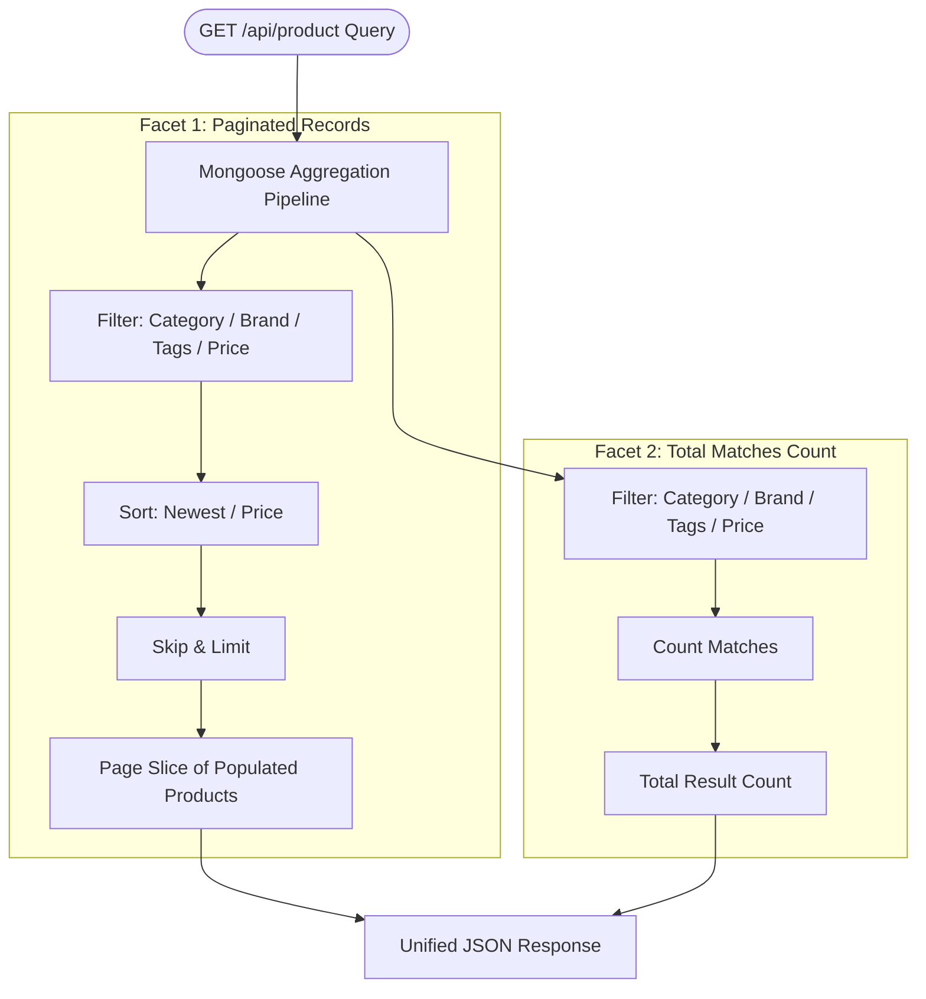

# HMarketplace Backend — Complete Product Documentation & System Guide

Welcome to the official product documentation for **HMarketplace**, a premium, high-performance, and clustered multi-worker e-commerce API platform. This guide explains the core features, operational roles, cascading transactions, asynchronous pipelines, and high-concurrency systems that power HMarketplace.

---

## 1. Product Introduction & Value Proposition

**HMarketplace** is an enterprise-grade e-commerce engine designed to sustain high concurrent traffic, protect data integrity during multi-stage checkout procedures, and ensure sub-millisecond response metrics under heavy loads.

### Core Architecture Highlights
- **Node.js Clustering & OS Scheduling**: Spawns multiple HTTP workers sharing a single TCP port, with an explicit Round-Robin scheduling override to guarantee even load distribution.
- **Asynchronous Workloading**: Dedicates a specific process to background jobs, completely isolating resource-intensive queue tasks (like bulk email processing or database synchronization) from client-facing connection threads.
- **Fail-safe Integrations**: Standardized local file storage fallbacks protect photo and email workflows from third-party vendor downtime (Cloudinary and Brevo).

---

## 2. Core User Roles & Access Control (RBAC)

The system manages user profiles using strict Role-Based Access Control (RBAC) across three distinct functional tiers:

```
                  ┌────────────────────────────────────────┐
                  │                 ADMIN                  │
                  │   Full read/write, seller approvals,   │
                  │   system parameters, global catalog    │
                  └───────────────────┬────────────────────┘
                                      │
                                      ▼
                  ┌────────────────────────────────────────┐
                  │                SELLER                  │
                  │  Own store management, products, tags, │
                  │  variants, coupons, shipping, stores   │
                  └───────────────────┬────────────────────┘
                                      │
                                      ▼
                  ┌────────────────────────────────────────┐
                  │               CUSTOMER                 │
                  │   Search, browse, shopping cart, CoD   │
                  │   ordering, reviews, and Q&A posts     │
                  └────────────────────────────────────────┘
```

### Role Capabilities Matrix

| Product Feature | Customer | Seller (Pending) | Seller (Approved) | Administrator |
| :--- | :---: | :---: | :---: | :---: |
| **Search & Catalog Browsing** | ✔ | ✔ | ✔ | ✔ |
| **Manage Personal Profile & Addresses** | ✔ | ✔ | ✔ | ✔ |
| **Add to Cart & Checkout (CoD)** | ✔ | ✘ | ✘ | ✔ |
| **Submit Review & Ask Q&A** | ✔ | ✘ | ✘ | ✔ |
| **Access Seller Dashboard** | ✘ | ✔ (Read-only Profile) | ✔ | ✔ (Bypass checks) |
| **Manage Custom Catalog Products** | ✘ | ✘ | ✔ | ✔ |
| **Create Variants & Upload Images** | ✘ | ✘ | ✔ | ✔ |
| **Issue Promotional Coupons** | ✘ | ✘ | ✔ | ✔ |
| **Configure GeoJSON Depots & Shipping** | ✘ | ✘ | ✔ | ✔ |
| **Approve/Reject Onboarding Sellers** | ✘ | ✘ | ✘ | ✔ |
| **Moderate Products / Suspend Users** | ✘ | ✘ | ✘ | ✔ |

---

## 3. High-Concurrency Signup Buffer (Write-Back Pipeline)

Traditional registration pipelines perform direct write and password-encryption operations, creating severe bottlenecks during marketing events or flash sales. 

HMarketplace resolves this with a **Stateless Asynchronous Signup Buffer**:
1. Incoming registration requests are fast-tracked: the server writes raw user data directly into an in-memory Redis set (`buffered:users`) in microseconds.
2. The user receives a success response immediately.
3. Every **10 seconds**, a background BullMQ worker (`UserQueue`) executes a repeatable job:
   - It atomically renames the set to isolate the batch and prevent race conditions.
   - It hashes passwords using AES-256-CBC, verifies unique constraints against the primary DB, and bulk-inserts users using MongoDB `insertMany(..., { ordered: false })`.
   - It queues welcome emails to be batch-transmitted.

### Signup Buffer Sequence Flow

```mermaid
sequenceDiagram
    autonumber
    actor Customer as Buyer Client
    participant Express as HTTP Worker
    participant Redis as Redis Cache (Set)
    participant Worker as BullMQ Worker
    participant MongoDB as MongoDB Database

    Customer->>Express: POST /api/auth/register
    Express->>Redis: SADD buffered:users (Raw Payload)
    Express-->>Customer: 201 Created (Instant Response)
    
    Note over Worker, Redis: Triggered every 10 seconds asynchronously
    Worker->>Redis: RENAME buffered:users -> tempKey
    Worker->>Redis: SMEMBERS tempKey
    Redis-->>Worker: Retreive batch of raw users
    
    rect rgb(20, 20, 30)
        Note over Worker: Password Hashing (AES-256-CBC) & Deduplication
    end
    
    Worker->>MongoDB: insertMany(usersBatch, { ordered: false })
    MongoDB-->>Worker: Bulk Insert Complete
    Worker->>Redis: DEL tempKey
```



---

## 4. Transaction-Safe Onboarding & Seller Verification

Sellers onboard through a dual-creation sequence combining both user credentials and business profiles. To prevent orphaned documents or partial record failures, the system leverages a strict **two-step transactional fallback flow**:

```
                       ┌─────────────────────────┐
                       │  POST /seller/register  │
                       └────────────┬────────────┘
                                    │
                                    ▼
                       ┌─────────────────────────┐
                       │   1. Create User Acc    │
                       │     (role: "seller")    │
                       └────────────┬────────────┘
                                    │
                                    ├─── (Failure) ──► [ Halt & Respond 500 ]
                                    ▼
                       ┌─────────────────────────┐
                       │ 2. Create Seller Record │
                       │    (GST/Business Info)  │
                       └────────────┬────────────┘
                                    │
                                    ├─── (Failure) ──► ┌─────────────────────┐
                                    │                  │  ROLLBACK ACTION    │
                                    │                  │  Delete User Acc    │
                                    │                  └──────────┬──────────┘
                                    │                             │
                                    │                             ▼
                                    │                  [ Respond 400 Bad Req ]
                                    ▼
                       ┌─────────────────────────┐
                       │  Both Records Created   │
                       │    (status: "pending")  │
                       └─────────────────────────┘
```

### Verification & Administrative Workflows
- **Pending Lock**: Onboarded sellers enter a `"pending"` status, locking their access to product listings or catalog operations.
- **Admin Review**: Admins review applied businesses. They can `"approved"` (which enables full store access and triggers a welcoming email) or `"rejected"` (which updates the database with a clear `rejectionReason`).
- **Voluntary Offboarding**: If a seller chooses to delete their business profile (`DELETE /api/seller/profile`), the system safely purges the `Seller` document and gracefully reverts the associated user credentials to a default `"customer"` account.

---

## 5. Master Catalog & O(1) Performance Indexing

An optimized catalog design ensures that heavy product browsing never degrades database responsiveness.

### Advanced Facet Query Engine
The product search endpoint (`GET /api/product`) uses a MongoDB `$facet` aggregation pipeline that executes exactly **1 database query** to handle:
- Pagination offsets (`$skip` and `$limit`).
- Text search matches against titles, descriptions, and brands.
- Multi-dimensional sorting (`priceAsc`, `priceDesc`, `newest`).
- Dynamic category, brand, and tag filtering.
- Automatic pricing bounds checks.
- Parallel joins mapping products to their lowest-price variant, active seller listing, real-time inventory, and price history logs.



### Core Data Integrity Rules
- **Decimal-Safe Math (Paise)**: Floating-point arithmetic causes structural precision loss in financial computations. HMarketplace represents all currency totals as **integers in Paise** (1 INR = 100 Paise). A price of ₹499.50 is written and calculated exclusively as `49950`.
- **Slug-Based Router**: Products are referenced publicly using SEO-friendly URL slugs (e.g., `brand-name-model-xyz`) rather than database IDs, protecting internal database structures.
- **Compound Compound Indexing**: Compound indexes protect the catalog from slow collection scans (`COLLSCAN`), routing queries directly through highly efficient index scans (`IXSCAN`):
  - `Product`: `{status: 1, moderationStatus: 1}`, `{status: 1, moderationStatus: 1, categoryId: 1}`, `{status: 1, moderationStatus: 1, brandId: 1}`.
  - `SellerListing`: `{variantId: 1, status: 1}`, `{sellerId: 1, status: 1}`.

---

## 6. Shopping Session & Cart Dynamics

The cart handles pre-purchase caching and verification of items, avoiding standard state conflicts:

- **Inventory Guarding**: When a customer adds items to their cart (`POST /api/cart`), the system performs real-time checks against `LISTING_INVENTORY.availableQuantity`. It blocks requests exceeding actual stock counts.
- **Price Snapshots**: To protect checkout calculations from mid-session seller edits, the cart saves in-memory snapshots of the product price (`pricePaiseSnapshot`), variant details, and default product images.
- **Promotional Clearance**: Coupons applied to the cart are dynamically validated against starts/ends constraints and min-order value thresholds before checkout is authorized.

---

## 7. Order Checkout & Cash on Delivery Cascades

The checkout sequence is designed as a **Cascading Transaction** that ensures strict database consistency across multiple collections. When a customer initiates order creation, the system processes steps in the exact sequence below:

```mermaid
graph TD
    Checkout([Checkout CoD Order]) --> ValidateStock{1. Validate Real-time Stock?}
    
    ValidateStock -- No/Insufficient --> Reject[422 Unprocessable: Out of Stock]
    ValidateStock -- Yes --> ApplyPromo[2. Validate & Calculate Discounts]
    
    ApplyPromo --> DeductInventory[3. Atomically Deduct Inventory]
    DeductInventory --> LogCoupon[4. Write Coupon Usage Ledger]
    LogCoupon --> CreateOrder[5. Save Order with address & item snapshots]
    CreateOrder --> ClearCart[6. Flush Customer Cart]
    ClearCart --> Webhooks[7. Emit order.created Webhook]
    Webhooks --> Response([201 Order Placed])

    style Reject fill:#3b1e1e,stroke:#9c2a2a,stroke-width:1px
    style Response fill:#1b3b1e,stroke:#2a9c3d,stroke-width:1px
```



### Action Workflows
1. **Validation**: Enforces real-time stock limits. If stock is available, it calculates MRP totals, selling totals, and coupon adjustments.
2. **Allocation**: Performs atomic deductions on `LISTING_INVENTORY.availableQuantity` and increments `reservedQuantity`.
3. **Redemption**: Creates custom `COUPON_USAGE` logs, tracking exactly how many times a code was used.
4. **Order Logging**: Saves a complete historical snapshot of the order, copying address details and product titles into the order document to shield past transactions from subsequent vendor updates.
5. **Session Wipe**: Safely empties `CART.items` array.
6. **Graceful Cancellation**: If the order is cancelled (`DELETE /api/orders/:id/cancel`), the system automatically executes a **restocking sweep**: returning reserved allocations back to `availableQuantity` and emitting state webhooks.

---

## 8. Promotional Coupon Optimization

Coupons provide sellers with powerful, highly targeted marketing capabilities:

* **Applicability Scopes**: A coupon can be restricted globally, scoped to a single category (e.g. only "Electronics"), limited to a specific product catalog entry, or locked to a particular seller's listings.
* **Discount Formats**: Supports `flat` value cuts (deducting fixed Paise sums) and `percent` cuts (calculating fractional reductions).
* **Quota Limits**: Features maximum discount caps (`maxDiscountValue`), minimum purchase requirements (`minOrderValue`), total promotional limits (`usageLimit`), and user reuse locks (`perUserLimit`).

---

## 9. Community Engagement Engine

Dynamic community contribution features are embedded directly within the catalog schemas to drive customer conversion rates:

### A. Interactive Reviews & Rating Distributions
Submitting a product rating (`POST /api/product/:id/reviews`) triggers automated DB calculations. 
Using Mongo's aggregation methods, the catalog recalculates and updates `Product.ratingAverage` and `Product.reviewCount` in real-time. Customers can attach photos and video URLs directly to reviews.

Additionally, the reviews subsystem provides advanced dynamic customer analytics and discovery options:
- **Dynamic Rating Distributions**: Every review query fetches an aggregated breakdown of ratings, returning the absolute count and percentage value for each star level (1 to 5 stars) using MongoDB aggregation.
- **Rating Filters**: Customers can filter reviews by specific rating levels (e.g. only view 5-star or 1-star reviews).
- **Advanced Sorting**: Supports custom sort parameters:
  - `helpful`: Sorts reviews by helpfulness votes descending (highlighting top community feedback).
  - `highest`: Sorts reviews by rating descending (highest rated first).
  - `lowest`: Sorts reviews by rating ascending (lowest rated first).
  - `newest`: Sorts reviews by timestamp descending (newest first).
- **Community Helpful Upvoting**: Authenticated users can upvote reviews as helpful (`POST /api/reviews/:reviewId/helpful`), dynamically incrementing helpfulness scores to improve community ranking.

### B. Verification-Backed Q&A System
- **Product Q&A**: Customers can submit questions regarding product details (`PRODUCT_QUESTION`), which are shown publicly upon approval.
- **Seller Answers**: Anyone can respond to questions, but replies posted by the actual supplying merchant are labeled with an `isSellerAnswer: true` verification flag, visually highlighting official seller statements.

---

## 10. Geo-Spatial Warehousing & Logistics Profiles

HMarketplace manages logistics variables through separate, customizable shipping models:

* **Logistics Profiles (`SHIPPING_PROFILE`)**: Sellers configure custom shipping profiles defining delivery processing durations and base pricing tiers (`free` shipping rules or standard `paid` base fees).
* **Geo-Spatial Depots (`SELLER_STORE`)**: Sellers register warehouse locations using standard **GeoJSON Point coordinates**:
  ```json
  "location": {
    "type": "Point",
    "coordinates": [ 72.8777, 19.0760 ]
  }
  ```
  This format enables PostGIS-equivalent spatial queries and distance calculations to estimate real-time shipping costs and local seller proximity search.

---

## 11. Resilient Asynchronous Email Transporter

Email notification streams (e.g. signup welcomes, order placement slips, seller approvals) are completely decoupled from primary web server routing:

### Redis-Buffered BCC-Batching
1. Standard endpoints never connect directly to mail networks. They push JSON payloads onto a Redis list stack (`email:stack`) in under a millisecond.
2. A background BullMQ queue (`EmailQueue`) triggers a flush task every **30 seconds**.
3. The queue pops the entire Redis stack, groups similar notifications together (e.g. 50 distinct user welcome notifications), and transmits them as a **single SMTP BCC connection** to preserve SMTP connections.

```
 [ Route Thread ] ──► Enqueue welcome email ──► Push to Redis ("email:stack")
                                                        │
                                                        ▼
┌────────────────────────────────────────────────────────────────────────┐
│  BACKGROUND EMAIL WORKER (Flushes every 30 seconds)                    │
│                                                                        │
│  1. Pops the "email:stack"                                             │
│  2. Groups emails by template type                                     │
│  3. Verifies Brevo Quota Limit (Redis: email:quota:daily)             │
│                                                                        │
│      ├─── Under 300 limit ──► Batch Send BCC SMTP via Brevo             │
│      └─── Over 300 limit  ──► Batch Send BCC SMTP via Ethereal Mock    │
└────────────────────────────────────────────────────────────────────────┘
```

### Brevo Quota Guard & Developer Fallbacks
Brevo's free tier imposes a strict limit of 300 emails per day. 
- The background worker tracks outgoing emails using an auto-expiring daily Redis counter (`email:quota:daily`).
- If this counter breaches the `EMAIL_DAILY_LIMIT` threshold, the system **automatically and gracefully swaps the SMTP transporter** to an auto-generated, sandbox-safe developer Ethereal transporter.
- This prevents backend runtime failures, keeps test sandboxes running, and outputs mock email preview URLs directly to worker logs.

---

## 12. Webhooks & Event-Driven Subscriptions

Integrate third-party internal logistics or tracking suites through lightweight webhook web subscription models:

- **Topic Subscriptions**: Consumers register unique payload endpoints and subscribe to specific system triggers (e.g., `product.created`, `order.created`, `order.cancelled`).
- **Cryptographic Signatures**: Payloads are signed using private customer-defined client secrets. Webhook headers contain signature hashes, enabling downstream servers to verify payload authenticity.
- **Stateless Dispatchers**: Event emissions are processed by background queues, separating web HTTP threads from remote webhook server latency issues.

---

## 13. Admin Control System, Financials & Bulk Moderation

HMarketplace implements a dedicated control suite accessible exclusively to users with the `"admin"` role, mounted under `/api/admin`. This system integrates operational cost tracking, action accountability, financial metrics, and inventory moderation:

### A. Administrative Audit Trail (`AuditLog`)
Every sensitive action performed by an administrator automatically writes a permanent record in the `AuditLog` collection. This trace records:
- **Toggling User Statuses**: Suspends or activates user log-in privileges (`USER_STATUS_UPDATE`).
- **Moderating Seller Onboarding**: Approves or denies seller business applications (`SELLER_STATUS_UPDATE`).
- **Account Purging**: Logs the administrative force-deletion of user accounts or seller businesses (`USER_DELETED`, `SELLER_DELETED`).
- **Finance Operations**: Tracks the creation of custom platform expenses (`EXPENSE_CREATED`).
- **Catalog Moderation**: Logs bulk actions taken to approve or reject new product offerings (`BULK_PRODUCT_MODERATION`).

### B. Platform Expense Tracker & Financial Summaries
To assist administrators in managing platform health, HMarketplace provides real-time financial tracking:
- **Operational Expense Logs (`Expense`)**: Admins can log custom administrative costs (e.g. cloud hosting subscription costs, logistics subsidies, marketing campaigns) using Paise integers to maintain full precision.
- **Profitability Dashboard**: A real-time aggregation endpoint combines completed sales revenues, pro-rated coupon discount costs (promotional expenses), and administrative expenses, returning the exact platform profit margin dynamically:
  $$\text{Net Profit} = \text{Delivered Sales Revenue} - (\text{Logistics \& Operational Expenses}) - \text{Coupon Promotional Subsidies}$$

### C. Bulk Product Moderation Queue
New products are posted in a `"pending"` moderation state, locking them from public query catalog indices. Admins manage entries via a centralized bulk moderation system:
- **Pending List**: Retrieves all catalog products currently awaiting administrative review (`GET /api/admin/moderation/products`).
- **Bulk Moderation Actions**: Allows admins to execute `"approve"`, `"reject"`, or `"hide"` decisions in batches of multiple product IDs in a single transaction (`POST /api/admin/moderation/products/bulk`).
- **Asynchronous Seller Alerts**: Processing bulk approvals or rejections automatically enqueues customized notification payloads directly into the background Redis `email:stack` queue, notifying the respective sellers in batches without blocking the admin's request-response cycle.
