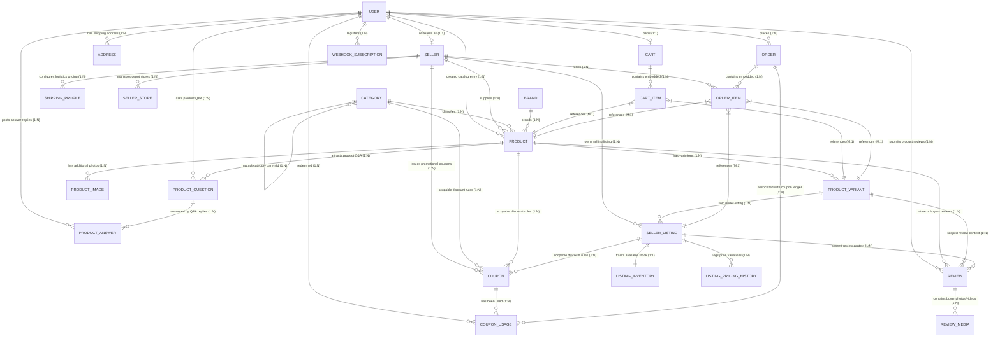

# HMarketplace — Entity Relationship (ER) Diagram & Route Operations Map

Below is the comprehensive architectural specification for the HMarketplace backend database. This document serves as a complete reference, containing the unified entity relationship structures, Mongoose schemas, and the explicit database interactions for every single API route.

---

## 📊 Database Relationship Diagram



---

## 🗃️ Database Entities & Field Specifications

### 1. USER
```json
{
  "_id": "ObjectId",
  "fullName": "string",
  "email": "string [unique]",
  "phone": "string [unique]",
  "passwordHash": "string",
  "avatarUrl": "string",
  "role": "customer | seller | admin [default: customer]",
  "isActive": "boolean [default: true]",
  "lastLoginAt": "Date",
  "createdAt": "Date",
  "updatedAt": "Date"
}
```

### 2. SELLER
```json
{
  "_id": "ObjectId",
  "userId": "ObjectId [ref: User, unique]",
  "businessName": "string",
  "gstNumber": "string [unique]",
  "businessPhone": "string",
  "businessEmail": "string",
  "approvalStatus": "pending | approved | rejected [default: pending]",
  "rejectionReason": "string [default: '']",
  "approvedBy": "ObjectId [ref: User]",
  "approvedAt": "Date",
  "ratingAverage": "number [default: 0]",
  "totalSales": "number [default: 0]",
  "createdAt": "Date",
  "updatedAt": "Date"
}
```

### 3. ADDRESS
```json
{
  "_id": "ObjectId",
  "userId": "ObjectId [ref: User]",
  "fullName": "string",
  "phone": "string",
  "line1": "string",
  "line2": "string",
  "landmark": "string",
  "city": "string",
  "state": "string",
  "country": "string",
  "pincode": "string",
  "isDefault": "boolean [default: false]",
  "createdAt": "Date",
  "updatedAt": "Date"
}
```

### 4. CATEGORY
```json
{
  "_id": "ObjectId",
  "name": "string",
  "slug": "string [unique]",
  "parentId": "ObjectId [ref: Category, null]",
  "level": "number [default: 1]",
  "path": "string[]",
  "isLeaf": "boolean [default: true]",
  "sortOrder": "number [default: 1]",
  "imageUrl": "string [default: '']",
  "isActive": "boolean [default: true]",
  "createdAt": "Date",
  "updatedAt": "Date"
}
```

### 5. BRAND
```json
{
  "_id": "ObjectId",
  "name": "string",
  "slug": "string [unique]",
  "logoUrl": "string [default: '']",
  "isVerified": "boolean [default: false]",
  "createdAt": "Date"
}
```

### 6. PRODUCT (Master Catalog)
```json
{
  "_id": "ObjectId",
  "categoryId": "ObjectId [ref: Category]",
  "brandId": "ObjectId [ref: Brand]",
  "sellerId": "ObjectId [ref: Seller, null]",
  "title": "string",
  "slug": "string [unique]",
  "shortDescription": "string",
  "longDescription": "string",
  "highlights": "string[]",
  "searchKeywords": "string[]",
  "attributeValues": "Mixed",
  "defaultVariantId": "ObjectId [ref: ProductVariant, null]",
  "status": "draft | active | blocked [default: active]",
  "moderationStatus": "pending | approved | hidden | removed [default: pending]",
  "moderationReason": "string [default: '']",
  "moderatedBy": "ObjectId [ref: User]",
  "ratingAverage": "number [default: 0]",
  "reviewCount": "number [default: 0]",
  "createdBy": "ObjectId [ref: User]",
  "approvedBy": "ObjectId [ref: User]",
  "createdAt": "Date",
  "updatedAt": "Date"
}
```

### 7. PRODUCT_IMAGE
```json
{
  "_id": "ObjectId",
  "catalogProductId": "ObjectId [ref: Product]",
  "variantId": "ObjectId [ref: ProductVariant, null]",
  "type": "image | video [default: image]",
  "imageUrl": "string",
  "alt": "string [default: '']",
  "sortOrder": "number [default: 0]",
  "isPrimary": "boolean [default: false]",
  "createdAt": "Date"
}
```

### 8. PRODUCT_VARIANT
```json
{
  "_id": "ObjectId",
  "catalogProductId": "ObjectId [ref: Product]",
  "sku": "string [unique]",
  "variantAttributes": "Record<string, string>",
  "barcode": "string [default: '']",
  "weight": "number [default: 0]",
  "dimensions": {
    "length": "number [default: 0]",
    "width": "number [default: 0]",
    "height": "number [default: 0]"
  },
  "isActive": "boolean [default: true]",
  "createdAt": "Date",
  "updatedAt": "Date"
}
```

### 9. SELLER_LISTING
```json
{
  "_id": "ObjectId",
  "sellerId": "ObjectId [ref: Seller]",
  "variantId": "ObjectId [ref: ProductVariant]",
  "sellerSku": "string",
  "condition": "new | refurbished [default: new]",
  "procurementType": "stock | dropship [default: stock]",
  "fulfillmentType": "seller | platform [default: seller]",
  "shippingProfileId": "ObjectId [ref: ShippingProfile, null]",
  "status": "active | paused | blocked [default: active]",
  "createdAt": "Date",
  "updatedAt": "Date"
}
```

### 10. LISTING_INVENTORY
```json
{
  "_id": "ObjectId",
  "listingId": "ObjectId [ref: SellerListing]",
  "availableQuantity": "number [default: 0]",
  "reservedQuantity": "number [default: 0]",
  "damagedQuantity": "number [default: 0]",
  "lowStockThreshold": "number [default: 5]"
}
```

### 11. LISTING_PRICING_HISTORY
```json
{
  "_id": "ObjectId",
  "listingId": "ObjectId [ref: SellerListing]",
  "mrpPaise": "number",
  "sellingPricePaise": "number",
  "startAt": "Date",
  "createdAt": "Date"
}
```

### 12. CART
```json
{
  "_id": "ObjectId",
  "userId": "ObjectId [ref: User, unique]",
  "couponCode": "string [null]",
  "items": [
    {
      "productId": "ObjectId [ref: Product]",
      "variantId": "ObjectId [ref: ProductVariant, null]",
      "quantity": "number [min: 1]",
      "titleSnapshot": "string",
      "imageSnapshot": "string [default: '']",
      "pricePaiseSnapshot": "number"
    }
  ],
  "createdAt": "Date",
  "updatedAt": "Date"
}
```

### 13. COUPON
```json
{
  "_id": "ObjectId",
  "sellerId": "ObjectId [ref: Seller]",
  "code": "string [unique]",
  "discountType": "percent | flat",
  "discountValue": "number",
  "minOrderValue": "number [default: 0]",
  "maxDiscountValue": "number",
  "usageLimit": "number",
  "perUserLimit": "number [default: 1]",
  "usedCount": "number [default: 0]",
  "startsAt": "Date",
  "endsAt": "Date",
  "isActive": "boolean [default: true]",
  "applicableProducts": "ObjectId[] [ref: Product]",
  "applicableCategories": "ObjectId[] [ref: Category]",
  "applicableListings": "ObjectId[] [ref: SellerListing]",
  "createdAt": "Date",
  "updatedAt": "Date"
}
```

### 14. COUPON_USAGE
```json
{
  "couponId": "ObjectId [ref: Coupon]",
  "userId": "ObjectId [ref: User]",
  "orderId": "ObjectId [ref: Order]",
  "discountPaise": "number",
  "usedAt": "Date"
}
```

### 15. ORDER
```json
{
  "_id": "ObjectId",
  "orderNumber": "string [unique]",
  "userId": "ObjectId [ref: User]",
  "addressId": "ObjectId [ref: Address]",
  "addressSnapshot": {
    "fullName": "string",
    "phone": "string",
    "line1": "string",
    "line2": "string",
    "landmark": "string",
    "city": "string",
    "state": "string",
    "country": "string",
    "pincode": "string"
  },
  "couponCode": "string",
  "couponDiscountPaise": "number [default: 0]",
  "mrpTotalPaise": "number",
  "sellingTotalPaise": "number",
  "productDiscountPaise": "number [default: 0]",
  "totalPaise": "number",
  "paymentStatus": "pending | paid | failed | refunded | partially_refunded [default: pending]",
  "paymentMethod": "cod",
  "status": "pending | confirmed | processing | shipped | delivered | cancelled | return_requested | returned [default: pending]",
  "notes": "string",
  "cancellationReason": "string [default: '']",
  "items": [
    {
      "productId": "ObjectId [ref: Product]",
      "variantId": "ObjectId [ref: ProductVariant, null]",
      "listingId": "ObjectId [ref: SellerListing, null]",
      "sellerId": "ObjectId [ref: Seller]",
      "titleSnapshot": "string",
      "imageSnapshot": "string [default: '']",
      "sku": "string",
      "quantity": "number [default: 1]",
      "mrpPaiseSnapshot": "number",
      "sellingPricePaiseSnapshot": "number",
      "couponDiscountPaiseForItem": "number"
    }
  ],
  "createdAt": "Date",
  "updatedAt": "Date"
}
```

### 16. WEBHOOK_SUBSCRIPTION
```json
{
  "_id": "ObjectId",
  "userId": "ObjectId [ref: User]",
  "url": "string",
  "secret": "string",
  "events": "string[]",
  "isActive": "boolean [default: true]",
  "createdAt": "Date",
  "updatedAt": "Date"
}
```

### 17. REVIEW
```json
{
  "_id": "ObjectId",
  "catalogProductId": "ObjectId [ref: Product]",
  "variantId": "ObjectId [ref: ProductVariant, null]",
  "listingId": "ObjectId [ref: SellerListing, null]",
  "userId": "ObjectId [ref: User]",
  "rating": "number [1-5]",
  "title": "string",
  "comment": "string",
  "verifiedPurchase": "boolean [default: false]",
  "helpfulVotes": "number [default: 0]",
  "status": "pending | approved | hidden [default: approved]",
  "createdAt": "Date",
  "updatedAt": "Date"
}
```

### 18. REVIEW_MEDIA
```json
{
  "_id": "ObjectId",
  "reviewId": "ObjectId [ref: Review]",
  "type": "image | video [default: image]",
  "url": "string",
  "createdAt": "Date"
}
```

### 19. PRODUCT_QUESTION
```json
{
  "_id": "ObjectId",
  "catalogProductId": "ObjectId [ref: Product]",
  "userId": "ObjectId [ref: User]",
  "question": "string",
  "status": "pending | approved | hidden [default: approved]",
  "createdAt": "Date",
  "updatedAt": "Date"
}
```

### 20. PRODUCT_ANSWER
```json
{
  "_id": "ObjectId",
  "questionId": "ObjectId [ref: ProductQuestion]",
  "userId": "ObjectId [ref: User]",
  "answer": "string",
  "isSellerAnswer": "boolean [default: false]",
  "helpfulVotes": "number [default: 0]",
  "createdAt": "Date",
  "updatedAt": "Date"
}
```

### 21. SHIPPING_PROFILE
```json
{
  "_id": "ObjectId",
  "sellerId": "ObjectId [ref: Seller]",
  "name": "string",
  "processingDays": "number",
  "shippingType": "free | paid [default: free]",
  "baseChargePaise": "number [default: 0]",
  "createdAt": "Date",
  "updatedAt": "Date"
}
```

### 22. SELLER_STORE
```json
{
  "_id": "ObjectId",
  "sellerId": "ObjectId [ref: Seller]",
  "name": "string",
  "address": {
    "line1": "string",
    "city": "string",
    "state": "string",
    "country": "string",
    "pincode": "string"
  },
  "location": {
    "type": "Point",
    "coordinates": "number[]"
  },
  "isActive": "boolean [default: true]",
  "createdAt": "Date",
  "updatedAt": "Date"
}
```

---

## 🛣️ HTTP Route Map & Entity Operations Flow

This section details how Express route requests interact with the database collections.

```
[HTTP Request] ──(Route Path)──> [Controller Action] ──(Queries/Updates)──> [MongoDB Database]
```

### 1. Authentication & Users (`/api/auth`)

| Method | Endpoint Path | Middlewares | Operations on Entities |
| :--- | :--- | :--- | :--- |
| `POST` | `/register` | *Multer (Avatar Upload)* | Creates a new `USER` document. If Redis is active, buffers to a Redis Set before write-back worker flushes to DB. |
| `POST` | `/login` | *Passport Local Strategy* | Verifies `USER` password, updates `USER.lastLoginAt`, and establishes Passport session. |
| `POST` | `/logout` | *authenticateUser* | Terminates active user session cookie. |
| `GET` | `/me` | *authenticateUser* | Reads active `USER` session, populates and attaches the user's `SELLER` profile details. |
| `GET` | `/users` | *authenticateUser + requireRoles("admin")* | Reads all `USER` records from DB (excluding password hashes). |
| `GET` | `/users/:id` | *authenticateUser* | Retrieves `USER` profile by direct ID parameter. (Self or Admin Only). |
| `PUT` | `/me` | *authenticateUser + Multer* | Updates own fields on the `USER` model, replaces user avatar picture. |
| `PUT` | `/users/:id/status`| *authenticateUser + requireRoles("admin")* | Toggles `USER.isActive` boolean (suspends or activates user). |
| `DELETE` | `/me` | *authenticateUser* | Deletes own `USER` profile and cascades to delete associated `SELLER` document. |
| `DELETE` | `/users/:id` | *authenticateUser + requireRoles("admin")* | Admin force-deletes `USER` profile and cascades to delete associated `SELLER` document. |

### 2. Sellers Onboarding (`/api/seller`)

| Method | Endpoint Path | Middlewares | Operations on Entities |
| :--- | :--- | :--- | :--- |
| `POST` | `/register` | *Multer* | Decoupled seller onboarding. Creates `USER` with role `"seller"`, then provisions `SELLER` with pending approval. |
| `GET` | `/profile` | *authenticateUser + requireRoles("seller")*| Fetches the logged in seller's `SELLER` database record. |
| `GET` | `/` | *authenticateUser + requireRoles("admin")*| Retrieves a list of all `SELLER` profiles, filtering by approval status. |
| `GET` | `/:id` | *None* | Public route. Retrieves public seller contact info by ID. |
| `PUT` | `/profile` | *authenticateUser + requireRoles("seller")*| Updates own `SELLER` business attributes. |
| `PUT` | `/:id/status` | *authenticateUser + requireRoles("admin")*| Updates `SELLER.approvalStatus` ("approved" | "rejected") and issues notification email. |
| `DELETE`| `/profile` | *authenticateUser + requireRoles("seller")*| Deletes `SELLER` document and reverts user's `USER.role` to `"customer"`. |
| `DELETE`| `/:id` | *authenticateUser + requireRoles("admin")*| Admin force-deletes `SELLER` profile and the referenced `USER` record. |

### 3. Addresses Management (`/api/address`)

| Method | Endpoint Path | Middlewares | Operations on Entities |
| :--- | :--- | :--- | :--- |
| `POST` | `/` | *authenticateUser* | Saves a new `ADDRESS` record. If marked default, clears other user addresses' default bit. |
| `GET` | `/` | *authenticateUser* | Lists all shipping `ADDRESS` records belonging to the caller `userId`. |
| `PUT` | `/:id` | *authenticateUser* | Edits specific address. (Ownership enforced). |
| `DELETE` | `/:id` | *authenticateUser* | Deletes target `ADDRESS` document. |

### 4. Catalog Products (`/api/product`)

| Method | Endpoint Path | Middlewares | Operations on Entities |
| :--- | :--- | :--- | :--- |
| `POST` | `/categories` | *authenticateUser + requireRoles("admin")*| Creates a new category entry (`CATEGORY`) and invalidates cache keys. |
| `GET` | `/categories` | *None* | Fetches active categories from cache if present; otherwise, queries `CATEGORY` and caches results. |
| `POST` | `/` | *authenticateUser + requireRoles("seller")*| Installs a new master catalog `PRODUCT` and default `PRODUCT_VARIANT`. If Redis is active, queues via BullMQ for stream processing. |
| `GET` | `/` | *None* | Paginated search of `PRODUCT`. Incorporates lowest-price seller listings by joining variants, listings, and pricing models. |
| `GET` | `/slug/:slug` | *None* | Fetches detailed view of a `PRODUCT` by its unique slug, populating sub-collections (`PRODUCT_IMAGE`s, `PRODUCT_VARIANT`s, active `SELLER_LISTING`s, and warehouse `LISTING_INVENTORY`s). |
| `PUT` | `/:id` | *authenticateUser + requireRoles("seller")*| Edits catalog product metadata (`PRODUCT`). |
| `DELETE`| `/:id` | *authenticateUser + requireRoles("seller", "admin")*| Performs cascading deletions on catalog product, listings, variants, media, inventories, and pricing histories. |

### 5. Media Uploads & Variants (`/api/product`)

| Method | Endpoint Path | Middlewares | Operations on Entities |
| :--- | :--- | :--- | :--- |
| `POST` | `/:id/images` | *authenticateUser + Multer* | Uploads product photos to Cloudinary, saving up to 10 entries to `PRODUCT_IMAGE` database records. |
| `DELETE`| `/images/:imageId`| *authenticateUser* | Removes specific media record from `PRODUCT_IMAGE`. |
| `POST` | `/:id/variants`| *authenticateUser + requireRoles("seller")*| Creates new `PRODUCT_VARIANT` and automatically inserts a `SELLER_LISTING`, `LISTING_INVENTORY`, and `LISTING_PRICING_HISTORY`. |
| `PUT` | `/variants/:variantId`| *authenticateUser + requireRoles("seller")*| Updates variant attributes, and dynamically adds pricing logs and inventory updates under its matching `SELLER_LISTING`. |
| `DELETE`| `/variants/:variantId`| *authenticateUser + requireRoles("seller")*| Deletes variant and performs cascading deletions on related listing components. |

### 6. Carts & Shopping Sessions (`/api/cart`)

| Method | Endpoint Path | Middlewares | Operations on Entities |
| :--- | :--- | :--- | :--- |
| `POST` | `/` | *authenticateUser* | Appends selected `PRODUCT` & variant to `CART.items` array. Performs real-time pricing and stock validation. |
| `GET` | `/` | *authenticateUser* | Retrieves customer's `CART`, returning real-time pricing snapshots. |
| `PUT` | `/items` | *authenticateUser* | Modifies item quantity inside the embedded `CART.items` array. |
| `DELETE`| `/items/:variantId`| *authenticateUser* | Removes specific item index from `CART.items`. |
| `DELETE`| `/` | *authenticateUser* | Empties the customer's `CART` document. |

### 7. Coupons Promotion (`/api/coupons`)

| Method | Endpoint Path | Middlewares | Operations on Entities |
| :--- | :--- | :--- | :--- |
| `POST` | `/` | *authenticateUser + requireRoles("seller")*| Creates a promotional `COUPON` scoped to specific product, category, or listing parameters. |
| `GET` | `/` | *authenticateUser + requireRoles("seller")*| Fetches active coupon list owned by the seller. |
| `DELETE`| `/:id` | *authenticateUser + requireRoles("seller")*| Removes a `COUPON` from availability. |

### 8. Order Placement & Cash on Delivery (`/api/orders`)

| Method | Endpoint Path | Middlewares | Operations on Entities |
| :--- | :--- | :--- | :--- |
| `POST` | `/` | *authenticateUser* | Processes checkout. Performs transaction checks: validates stock, calculates discounts, saves `ORDER` with embedded `ORDER_ITEM`s, reduces `LISTING_INVENTORY`, logs `COUPON_USAGE`, flushes the user's `CART`, and dispatches order-creation webhooks. |
| `GET` | `/` | *authenticateUser* | Retrieves order history for the logged in buyer `USER`. |
| `GET` | `/:id` | *authenticateUser* | Retrieves a specific order by ID (ownership enforced). |
| `PUT` | `/:id/status`| *authenticateUser + requireRoles("admin")* | Updates order delivery/fulfillment status. |
| `DELETE`| `/:id/cancel`| *authenticateUser* | Cancels the `ORDER`, restocks inventory, and triggers order cancellation webhooks. |

### 9. Product Reviews & Media (`/api`)

| Method | Endpoint Path | Middlewares | Operations on Entities |
| :--- | :--- | :--- | :--- |
| `POST` | `/product/:id/reviews`| *authenticateUser* | Submits product rating review. Creates `REVIEW` and optional `REVIEW_MEDIA` records, then recalculates `PRODUCT.ratingAverage` and `PRODUCT.reviewCount` dynamically. |
| `GET` | `/product/:id/reviews`| *None* | Public route. Lists all approved `REVIEW` records alongside associated photos. |

### 10. Product Q&A Systems (`/api`)

| Method | Endpoint Path | Middlewares | Operations on Entities |
| :--- | :--- | :--- | :--- |
| `POST` | `/product/:id/questions`| *authenticateUser* | Submits buyer question to `PRODUCT_QUESTION` model. |
| `GET` | `/product/:id/questions`| *None* | Public route. Retrieves all approved questions for a product. |
| `POST` | `/question/:questionId/answers`| *authenticateUser* | Submits answer to `PRODUCT_ANSWER` model, automatically marking `isSellerAnswer` true if answered by the creator seller. |
| `GET` | `/question/:questionId/answers`| *None* | Public route. Retrieves replies sorted by helpful votes. |

### 11. Shipping Logistics (`/api`)

| Method | Endpoint Path | Middlewares | Operations on Entities |
| :--- | :--- | :--- | :--- |
| `POST` | `/shipping` | *authenticateUser + requireRoles("seller")*| Configures custom logistics rules, saving to the `SHIPPING_PROFILE` collection. |
| `GET` | `/shipping` | *authenticateUser + requireRoles("seller")*| Returns shipping options registered to the caller seller. |

### 12. Depots & Warehouse Stores (`/api`)

| Method | Endpoint Path | Middlewares | Operations on Entities |
| :--- | :--- | :--- | :--- |
| `POST` | `/stores` | *authenticateUser + requireRoles("seller")*| Registers a fulfillment center location to the `SELLER_STORE` collection. Coordinates are saved as a GeoJSON Point for spatial calculations. |
| `GET` | `/stores` | *authenticateUser + requireRoles("seller")*| Returns active warehouse pickup locations belonging to the seller. |
