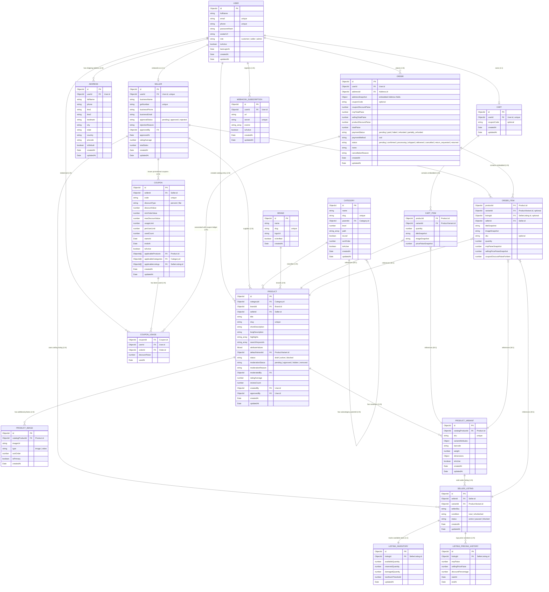

# HMarketplace — Entity Relationship (ER) Diagram

Below is the complete entity-relationship structure representing the currently implemented database architecture for the HMarketplace backend.

---

## 📊 Database Relationship Diagram

---

## 📝 Relationship Design Context

1. **User & Seller (1:1)**:
   A `User` can register to become a `Seller`. The seller profile contains business details (business name, GST number) and maintains a direct `userId` reference to its owner user account. If onboarding fails at creation time, a unified rollback cascades to keep data consistent.
2. **Products, Variants & Listings (1:M:M)**:
   A catalog product represents the shared specification (e.g. *iPhone 15*). The product is divided into one or more variations (`ProductVariant` color/storage). Multiple independent sellers can list the same variant for sale using `SellerListing`. This maps to high-performance aggregators.
3. **Cart & CartItems (Embedded 1:N)**:
   Instead of running costly database multi-joins, the customer's cart stores a single document referencing the `User`. Cart lines are embedded directly as a sub-document array.
4. **Seller Coupons (1:N) & coupon scoping**:
   Sellers issue promotional coupons (`Coupon`). The coupon can be scoped by products, categories, or seller listings. The cart validator dynamically filters cart items using these scoping arrays to calculate discounts.
5. **Coupon Usage Tracking**:
   Every coupon redemption is recorded inside the transactional `CouponUsage` ledger. This provides compound-index backed validation for per-user limits and guarantees auditable logs.
6. **Orders & OrderItems (Embedded 1:N)**:
   Placed orders are saved as individual `Order` documents referencing the `User` and `Address` snapshots. Line items are embedded directly inside each order as an `OrderItem` array, keeping snapshots of title, sku, pricing, and pro-rated coupon discounts frozen at purchase time for bookkeeping integrity. The payment gateway integrations are completely bypassed in favor of instant Cash on Delivery confirmation.
7. **Outgoing Webhook Subscriptions (1:N)**:
   Sellers and administrators can register outgoing webhook URLs to receive real-time, `HMAC-SHA256` signed JSON events. Webhook configurations are tracked inside the `WebhookSubscription` schema, supporting secure background notifications of crucial updates.
